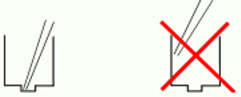

# GeneLab SOP for Quality Analysis of RNA using Agilent Bioanalyzer 2100 System #
Document No.:	GL-SOP-4.3  
Version:	1.0  
Created:	01_14_2019  
Last revised: 	05_05_2020  
Last revised by:	Valery Boyko  

## Purpose/Scope: ##
This procedure describes the steps required to perform automated electrophoresis of RNA samples. This procedure is using the Agilent 2100 Bioanalyzer System and Agilent RNA 6000 Nano and Pico kits. This procedure will generate a gel image of the RNA as well as RIN and DV200 values, those are recorded and used to track sample quality. 

Read the following additional information prior executing this SOP: 
* [Agilent 2100 Bioanalyzer Expert Software Users Guide](https://www.agilent.com/cs/library/usermanuals/public/2100_Bioanalyzer_Expert_USR.pdf)
* [Agilent 2100 Bioanalyzer System Guide](https://www.agilent.com/cs/library/usermanuals/public/2100-Bioanalyzer_Maintenance-Troubleshooting_USR_ENG.pdf)
* [Agilent RNA 6000 Nano Kit Guide](https://www.agilent.com/cs/library/usermanuals/public/G2938-90034_RNA6000Nano_KitGuide.pdf) 
* [Agilent RNA 6000 Pico Kit Guide](https://www.agilent.com/cs/library/usermanuals/public/G2938-90046_RNA600Pico_KG_EN.pdf)  

## Equipment and consumables: ##

1.	Chip priming station (Agilent cat#5065-4401) 
2.	KIA vortex mixer 
3.	DNA LoBind Microcentrifuge Tubes1.5mL (Thermo Scientific, Cat#13-698-791)
4.	2100 Bioanalyzer system (Agilent, Cat#G2939BA) 
5.	Table top vortex(VWR, Cat#102091-234 or similar)
6.	Bench top microcentrifuge to accommodate 1.5mL tubes (Thermo Scientific Cat#75004081 or similar)

## Reagents: ##
1.	One of the following kits*:  
  a. Agilent RNA 6000 Nano Kit (Agilent, cat#5067-1511) 
Number of samples/chip: 12, qualitative range: 5-500nG/uL  
  b. Agilent RNA 6000 Pico Kit (Agilent cat#5067-1513)  
Number of samples/chip: 11, qualitative range: 50-5000 pG/uL (0.05-5nG/uL) 

*Choose a kit base on the quantitative range of the kits.  

2.	RNase/DNase free water (Thermo Fisher Scientific, Cat#10977023) 
3.	RNaseZap RNase Decontamination Solution (Thermo Fisher Scientific, Cat# AM9780 or similar) 

## Procedure: ##
1.	Take the RNA 6000 kit (without the ladder! Ladder handling described in detail in Reagent Prep section 3 of this SOP) out of storage and let it equilibrate to RT for a minimum of 30min prior use.  
  a. Always insert the pipette tip to the bottom of the well when dispensing the liquid. 

  

  b. Use loaded chips within 5-15 min after preparation.
  
2.	Make sure that the chip priming station and the KIA vortex mixer are set up for the specific kit used:   
  a. Replace the syringe with each new kit (Syringes are provided with each RNA kit).   
  b. Adjust the base plate of the chip priming station:  
* Nano kit: position C  
* Pico kit: position C  

c. Adjust the syringe clip at the chip priming station:  
* Nano kit: top position   
* Pico kit: top position   

d. Set up KIA vortex mixer speed to 2400 RPM.  
3.	Filtered tips can shed particulates that may enter the get and cause data spikes, use unfiltered tips if possible.  
4.	Handling Gel-Dye solution:  
  a. For each well, use a new tip and dispense the gel-dye solution slowly. If volume variation occurs, the instrument will fail to recognize the chip.  
  b. To avoid introducing bubbles, set the pipet to 10uL and stop dispensing the liquid after the first stop of the pipette plunger. (vs. attempting to expel all the gel from a pipette set to 9uL).  
  c. Protect the solution from light.  

### Starting the 2100 Expert Software ###
1.	It is important to turn the Expert Software on before preparing the chip. 
2.	Once on, make sure the connection with the Bioanalyzer is established.

### Reagent prep and chip loading ###
3.	Preparing the ladder after arrival:
*Nano kit*: 
  a. Spin down the ladder tube.  
  b. Heat denature the ladder for 2 min at 70°C. If using the heat block, make sure an appropriate tube holder that allows for skintight contact with the tube is used. Also, use the tube holder lid.   
  c. Immediately cool the vial on ice.  
  d. Prepare 1.3uL aliquots in RNase-free vials.  
  e. Store the aliquots in -80°C.    
*Pico kit*:
  a. Spin Down the ladder tube.  
  b. Heat denature the ladder for 2 min at 70°C. If using the heat block, make sure an appropriate tube holder that allows for skintight contact with the tube is used. Also, use the tube holder lid.  
  c. Immediately cool the vial on ice.  
  d. Add 90uL of RNase free water and mix thoroughly.  
  e. Prepare 1.3uL aliquots in RNase free vials.  
  f. Store aliquots in -80°C.  

4.	Preparing the Gel (Nano, Pico kits):   
  a.	Place 550uL of Agilent Nano gel matrix (red o) into the top receptacle of a spin filter.  
  b.	Place the spin filter in a microcentrifuge and spin for 10min at 1500 RCF/4000 RPM.  
  c.	Aliquot 65uL of the filtered gel into 0.5uL RNase free tube and store in 4°C.  
  d.	Use aliquots within one month of preparation.  

5.	Preparing Gel-Dye mix, sufficient for 2 chips. (Nano, Pico kits):  
  a.	Vortex the RNA dye concentrate (blue o) for 10sec and spin down.  
  b.	Add 1uL of RNA dye concentrate to a 65uL aliquot of filtered gel.  
  c.	Cap tube, vortex thoroughly for 30sec.  
  d.	Spin tube for 10min at RT at 13,000 RCF.  
  e.	Protect the Gel-Dye tube from light and use within one day from preparation. Keep at 4°C until use.  
  f.	If reusing the Gel-Dye after 5+ HR from preparation, repeat the 10min spin down prior use.  

6.	Loading Gel-Dye :  
*Nano and Pico kits*:  
  a.	Take a new RNA chip out and place it on the chip priming station.   
  b.	Pipette 9uL of the gel-dye mix at the bottom of the well marked  and dispense the gel-dye mix slowly.   
  c.	Set timer to 30sec; make sure the syringe plunger positioned at 1ml.    
  d.	Close the chip priming station until the latch clicks.  
  e.	 Press the plunger of the syringe until it is held by the clip.  
  f.	Wait for exactly 30sec and then release the plunger with the clip release mechanism.  
  g.	Visually inspect that the plunger moves back at least to the 0.3mL mark.  
  h.	Wait for 5sec, then slowly pull back the plunger to the 1mL position.  
  i.	Open the chip priming station.  
  j.	Pipette 9.0uL of the gel-dye mix in to two of the wells marked. 
  
  Additional *Pico Kit step*: Loading the RNA Pico Conditioning Solution:  
  k.	Pipette 9.0uL of the RNA Pico conditioning solution (white o) in to the well marked CS.  

7.	Loading Marker   
  a.	Pipette 5uL of the marker (green o) into the well marked with the ladder symbol and each of the sample wells. Stop dispensing after reaching the “hard stop” of the pipette to avoid introduction of bubbles.  
    * If any of the sample wells won’t be used – fill them with 6uL of marker.  

8.	Loading the ladder and samples:   
  a.	Pipette 1uL of the RNA ladder in to the well marked with the ladder symbol. Rinse tip in Marker solution by pipetting 4-5x.  
  b.	Pipette 1uL of each sample into each of the 11/12 sample wells. Rinse tip in Marker solution by pipetting 4-5x.  
  c.	Place the chip horizontally in the IKA vortex mixer, vortex for 60sec at 2,400 RPM.  

#### Reading the Chip on the 2100 Bioanalyzer ####
9.	*Make sure the 2100 software is open and connected to the Bioanalyzer instrument.*
10.	Fill the empty wash chip with 350uL of RNase-DNase free water.
11.	Open the lid of the 2100 Bioanalyzer instrument and insert the wash chip.
12.	Close the lid for 60sec to wash the electrodes.
13.	Open the lid, discard the water from the wash chip, and wait for 60sec to allow the water to evaporate from the electrodes. Place the assay chip in to the receptacle after step 8.c. is completed. 
14.	Carefully close the lid. 
15.	The 2100 Expert Software screen will indicate that the lid was closed and will identify the inserted chip. 

