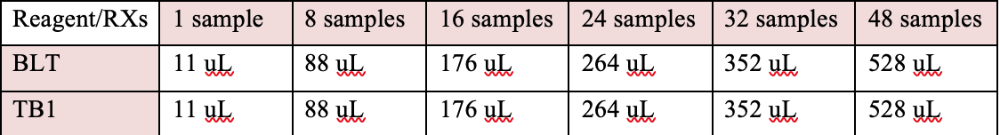
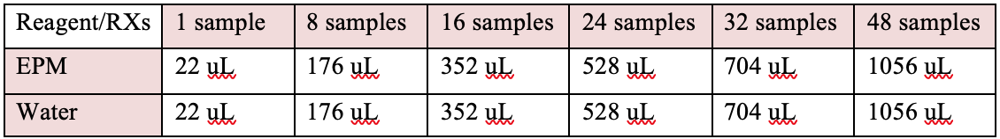

# GeneLab SOP for Illumina Nextera DNA Flex Manual Library Preparation #
Document No.:	GL-SOP-5.3  
Version:	1.0  
Created:	04_07_2020  
Last revised: 	04_07_2020  
Last revised by:	Valery Boyko  

## Purpose/Scope: ##
This procedure follows the Illumina Nextera DNA Flex Library Prep Guide, Doc# 1000000025416 v07. 
It is strongly advised to read the guide in full before using this SOP. 

## Reagents: ##
1.	Illumina Nextera DNA Flex Library Prep Kit (Illumina, Cat#20018705)
2.	IDT for Illumina Nextera DNA Unique Dual Indexes set A-D (Illumina,Cat#20027213-6)
3.	Ethanol 200 proof (absolute) for molecular biology (Sigma-Aldrich, Cat#E7023 or similar)
4.	Nuclease-free Water 

## Equipment ##
1.	Magnetic stand-96 (Thermo Fisher Scientific, Cat#AM10027) 
2.	Microplate centrifuge
3.	Microplate vortex
4.	Micro-centrifuge
5.	Vortex
6.	Bio-Rad C-1000 Touch thermal cycler

## General Instructions: ##
1.	Recommended input amount of DNA is 500nG for large genome organisms(murine) and 200-300ng for small genome organisms (microbial). 
2.	The tagmentation protocol won’t normalize final library yield for samples prepped from < 100nG of DNA.
3.	Make sure to record the sample information with the Index ID that will be added to each sample. 
4.	Always seal plates with adhesive seal before vortexing, spinning or PCR steps.
5.	Only stop during safe stopping points of the procedure.
6.	If not using the whole kit, label the used tubes on top of the lid with the abbreviation of the consumable name. 
7.	If preparing >8 libraries use a multichannel to dispense reagents to save time:  
  a.	Aliquot the reagent into 8-tube strip or a reagent plate.  
  b.	Transfer reagent from strip/reagent plate on to the reaction plate.  
  c.	Dispose of the 8-tube strips when done. If using a reagent plate, cross out the used reagent title.  
8.	Bead handling:  
  a.	Always store beads upright in the refrigerator.  
  b.	Vortex bead stock thoroughly until all beads are resuspended.  
  c.	Avoid disturbing bead pellet.  
  d.	Never store beads at below 2°C.
9.	Create the following PCR programs 

a.	Program 1: TAG  
•	Preheat lid to 100°C  
•	Set reaction volume to 50uL  
•	55°C for 15min  
•	Hold at 10°C  
b.	Program 2: PTC  
•	Preheat lid to 100°C  
•	Set reaction volume to 60uL  
•	37°C for 15min  
•	Hold at 10°C  
c.	Program 3: BLT PCR  
•	Preheat lid to 100°C  
•	68°C for 3min  
•	98v for 3min  
•	5 cycles of  
1.	98°C for 45sec
2.	62°C for 30sec
3.	68°C for 2min  
•	68°C for 1min  
•	Hold at 10°C  

*Step 1: Tagment Genomic DNA*
### Consumables ###  
•	Bead-Linked Transposome (**BLT, yellow cap**)  
•	Tagmentation Buffer 1 (**BT1**)   
•	Nuclease-free water  

### Preparation ###
1.	Prepare the following consumables:  
  a.	BLT – take out of 4°C storage and bring to room temperature. Vortex to mix and do not centrifuge before pipetting.  
  b.	TB1 – take out of -20°C storage and bring to room temperature. Vortex to mix.  

### Procedure ###
1.	Add 100-500nG DNA into each well of the 96-well PCR plate and bring the total volume to 30uL with nuclease-free water
2.	Vortex BLT vigorously for 10 seconds, repeat as needed 
3.	Make a tagmentation master mix by combining BLT and TB1 (reagent overage included).

4.	Vortex the tagmentation master mix
5.	Using multi-channel, transfer 20uL of the master mix into each well of the plate containing the samples. Change tips between each column. 
6.	Mix the sample with the master mix by pipetting each row 10 times or by vortexing the plate for 1min at 1800 RPM. 
7.	Seal the plate and place on the thermal cycler. Run TAG program. 

*Step 2: Post tagmentation cleanup*
### Consumables ###  
•	Tagment Stop Buffer (**TSB**)  
•	Tagment Wash Buffer (**TWB**)  

### Preparation ###
1.	Prepare the following consumables:  
  a.	TSB – stored at RT. If precipitates observed, heat at 37°C for 10min and then vortex until dissolved.  Use at room temperature.  
  b.	TWB – Stored at RT. Foaming easily. 

### Procedure ###
1.	Add 10uL TSB to the tagmentation reaction using a multichannel pipette. 
2.	Pipette each well 10 times to mix, alternatively, mix by vortexing for 20sec at 1800 RPM. 
3.	Seal plate and place on the thermal cycler. Run the PTC program. 
4.	Take plate out of the thermal cycler and let stand at RT for 1min. 
5.	Place the plate on the magnetic stand and wait 3-5min until the liquid is clear.
6.	Using a multichannel pipette, remove and discard supernatant. Avoid touching the bead pellet. 
7.	Wash twice as following:  
  a.	Remove plate from magnetic stand. Very slowly add 100uL of TWB to avoid foaming.  
  b.	Pipette slowly until the beads are fully resuspended.  
  c.	Place the plate on the magnetic stand and wait 3-5min until the liquid is clear.  
  d.	Remove and discard the supernatant.  
8.	Remove plate from magnetic stand; very slowly add 100uL of TWB to avoid foaming.
9.	Pipette each well slowly to resuspend the beads.
10.	Place plate on magnetic stand. 

*Step 3: Amplify Tagmented DNA*
### Consumables ###  
•	Enhanced PCR Mix (**EPM**)  
•	Index adapters  
•	Nuclease-free water  
•	Ice  

### Preparation ###
Prepare the following consumables:  
  a.	EPM – take out of -20°C and thaw on ice. Invert to mix and briefly centrifuge. DO NOT VORTEX.  
  b.	Index Adapters – take out of -20°C storage and bring to room temperature. Vortex to mix and centrifuge briefly.   

### Procedure ###
1.	Make the PCR master mix by combining EPM and water (reagent overage included)

2.	Briefly vortex and centrifuge the master mix tube. 
3.	Use a 200uL multichannel pipette to remove and discard the supernatant from the reaction plate on the magnet. 
Some foam is okay and will not affect the reaction. 
4.	Remove plate from magnet.
5.	Add 40uL of PCR master mix directly onto the beads in each sample well 
6.	Pipette each well 10 times to mix, alternatively, mix by vortexing for 1min at 1600 RPM 
7.	Seal the plate and place on the thermal cycler. Run the BLT PCR program. 

**_This is a safe stopping point. Store plate at 4C for up to 3 days._**

*Step 4: Clean up libraries*
### Consumables ###
•	Sample Purification Beads (**SPB**)  
•	Resuspension Buffer (**RSB**)  
•	Freshly prepared 80% ethanol (**EtOH**)  
•	Nuclease-free water  
•	Midi plates   

### Preparation ###
Prepare the following consumables:  
  a.	SPB – take out of 4°C storage. Let stand at room temperature for 30 minutes. Vortex and invert to mix.   
  b.	RSB – take out of -20°C storage and bring to room temperature. Vortex to mix.  
  c.	Make fresh 80% EtOH from absolute ethanol and nuclease-free water  

### Procedure ###
1.	Centrifuge the plate briefly and spin down.
2.	Place the plate on the magnetic stand and wait 3-5min until the liquid is clear.
3.	Transfer 45uL of supernatant from each well of the PCR plate to the corresponding well of a new midi plate.
4.	Vortex and invert SPB multiple times until well resuspended. Vortex the beads often and pipette slowly. 
5.	For double sided bead size selection follow the steps below:  
  a.	Add 40uL nuclease-free water in to each well containing supernatant.  
  b.	Add 45uL SPB to each well.  
  c.	Pipette each well 10 times to mix, alternatively, mix by vortexing for 1min at 1600 RPM.  
  d.	Incubate the sealed plate at room temperature for 5 minutes.  
  e.	Place the plate on the magnetic stand and wait 5 minutes until the liquid is clear.  
  f.	While the first midi plate is incubating, vortex the SPB and add 15uL of beads in to wells of a new midi plate.   
  g.	Transfer 125uL of supernatant from each well of the first plate into the corresponding well of the second plate containing 15uL SPB.  
  h.	Pipette each well 10 times to mix, alternatively, mix by vortexing for 1min at 1600 RPM.  
  i.	Discard the first midi plate.  
6.	Incubate the sealed midi plate at room temperature for 5 minutes.
7.	Place the plate on magnetic stand and wait 5 minutes until the liquid is clear.
8.	Without disturbing the beads, remove and discard the supernatant. 
9.	Wash twice as following: 
  a.	With the plate on the magnetic stand, add 200uL of fresh 80% EtOH.  
  b.	Incubate for 30sec.  
  c.	Without disturbing the beads, remove and discard the supernatant.  
10.	Use 20uL pipette to remove and discard any residual EtOH from each well. 
11.	Air-dry the plate on magnetic stand for 5 minutes. 
12.	Remove plate from magnetic stand.
13.	Add 32uL of RSB on to the beads.
14.	Pipette to thoroughly resuspend the beads. 
15.	Incubate the plate at room temperature for 3 minutes. 
16.	Place plate on magnetic stand and wait 5 minutes until the liquid is clear.
17.	Transfer 30uL of supernatant to a new 96-well PCR plate. 

