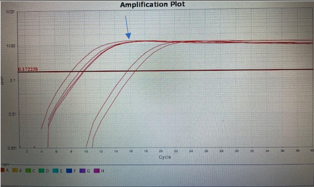

# GeneLab SOP for QIAseq UPX 3' Transcriptome Librray Prep #
Document No.:	GL-SOP-5.4  
Version:	1.0  
Created:	10_15_2021  
Last revised: 	10_15_2021  
Last revised by:	Lovorka Degoricija

#
## Scope and Purpose

This procedure follows the [QIAseq UPX 3&#39; Transcriptome Handbook](https://www.qiagen.com/us/resources/resourcedetail?id=28512222-986f-4027-bb45-2c7e65d3fd2b&amp;lang=en) to generate RNA-seq libraries from low input purified RNA. It is strongly advised to read this document in full before using the SOP.

#
## Equipment

1. Eppendorf Centrifuge 5804 (Eppendorf Cat # 022622501 or similar)
2. Bench top microcentrifuge to accommodate 1.5mL tubes (Thermo Scientific Cat # 75004081 or similar)
3. Qubit® Fluorometer (Thermo Fisher Scientific Cat # varies)
4. Qubit Assay Tubes (Thermo Fisher Scientific Cat# Q32856)
5. DNA LoBind Microcentrifuge Tubes 1.5mL (Thermo Scientific, Cat #13-698-791)
6. Thermal cycler
7. 1.5mL tube magnetic separation stand (Promega Cat # Z5342 or similar)
8. twin.tec 96-well LoBind PCR Plate, semi-skirted (Eppendorf Cat # 0030129504 or similar)
9. Adhesive PCR plate seals (Thermo Fisher Scientific Cat # AB0558)
10. QuantStudio™ 6 Flex Real-Time PCR System (Thermo Fisher Cat # 4485697 or similar)
11. MicroAmp™ EnduraPlate™ Optical 96-well fast clear reaction plates (Thermo Fisher Cat # A36930)
12. MicroAmp Optical Adhesive Film, 100 covers (Fisher Scientific Cat # 43-119-71 or similar)
13. 4200 TapeStation system (Agilent Cat # G2991BA or similar)

#
## Reagents

1. QIAseq UPX 3&#39; Transcriptome Kit (96) (Cat # 333088) or QIAseq UPX 3&#39; Transcriptome Kit (96-M) (Cat # 333089) or QIAseq UPX 3&#39; Transcriptome Kit (384) (Cat # 333090)
2. QIAseq UPX 3&#39; Trans. 12-index (48) (Cat # 333074) or QIAseq UPX 3&#39; Trans. 48-index (192) (Cat # 333075)
3. QIAseq Library Quant Assay Kit (Cat # 333314)
4. Ethanol 200 proof (absolute) for molecular biology (Sigma-Aldrich Cat # E7023 or similar)
5. Qubit dsDNA HS Assay Kit (Thermo Fisher Scientific cat. no. Q32854)
6. High Sensitivity D1000 Reagents (Agilent Cat # 5067-5585)
7. High Sensitivity D1000 ScreenTape (Agilent Cat # 5067-5584)
8. HT1 Buffer (Illumina Cat # 20015892).

#
## General Practices and Notes

1. Follow the [QIAseq UPX 3&#39; Transcriptome Handbook](https://www.qiagen.com/us/resources/resourcedetail?id=28512222-986f-4027-bb45-2c7e65d3fd2b&amp;lang=en) Section 2 to generate UPX libraries from purified RNA.

**Note:** If generating libraries from lysed cells, please refer to the handbook for more details.

2. Follow the [QIAseq UPX 3&#39; Transcriptome Handbook](https://www.qiagen.com/us/resources/resourcedetail?id=28512222-986f-4027-bb45-2c7e65d3fd2b&amp;lang=en) to re-buffer the QIAseq RQ beads.

**Note:** Only re-buffer the quantity you will need to use in one week

3. Make sure to prepare fresh 80% ethanol for the purification steps.
4. Follow SOP 5.2 &quot;Use of ERCC spike-in mixes and UMRR/UHRR controls for total RNA-sequencing&quot; for adding ERCC controls to extracted RNA prior to initiating the QIAseq UPX 3&#39; Transcriptome protocol.
5. Do not vortex reactions or reagents unless instructed to do so.
6. Remove enzymes from -20°C freezer only when ready for use and immediately place them back in a -20°C freezer when finished.

#
## Procedure

**Reverse Transcription**

1. Dilute samples that contain ERCC controls to 4ng/uL using nuclease-free water.
2. Prepare the RT master mix as described in Table 1 below and scale up according to the number of reactions.

**Note:** Keep all components on ice and pipette mix the RNase Inhibitor and EZ Reverse Transcriptase. All other components can be vortexed.

Table 1:Preparation of RT master mix for a single reaction when using the single-use Cell ID RT plates. Overage is included, but you can add extra reactions to ensure enough master mix for all your samples.

| **Component** | **Volume (uL)** |
| --- | --- |
| **Cell Lysis Buffer** | 1.25 |
| **RNase Inhibitor** | 0.3125 |
| **3&#39; Trans RT Buffer** | 1.25 |
| **EZ Reverse Transcriptase** | 0.3125 |
| **Total** | 3.125 |

3. Cut the number of wells that correspond to the number of your samples and break away any wells that will not be used.
4. For single use Cell ID RT Plates (CID-96S), aliquot 2.5uL of purified RNA followed by 2.5uL of RT master mix created from Table 1 into the Cell ID RT plate.
5. Pipette mix all the components together and seal the plate with Qiagen provided strip caps.

**Note:** Do not use adhesive covers as some evaporation may occur during the RT incubation. Strip caps minimize evaporation and thus are the preferred method for sealing the plate.

6. Briefly centrifuge the plate ensuring all solution is at the bottom of the well.
7. Incubate the plate as described in Table 2.

Table 2: Reverse transcription incubation

| **Time** | **Temperature** |
| --- | --- |
| **10 min** | 25°C |
| **90 min** | 42°C |
| **15 min** | 70°C |
| ∞ | 4°C |

8. Upon completion of the reverse transcription reactions, combine the synthesized cDNA from the different wells into one 1.5 mL microcentrifuge tube. Up to 96 wells can be combined in one tube.

**Note:** Combine only the wells that will be sequenced together based on your pooling strategy.

**Note:** Minimally, the volume of the combined sample must be 100 μL. If the combined sample is not 100 μL, add Nuclease-Free Water to bring the volume to 100 μL.

**Note:** The cDNA generated from each well of a Cell ID RT Plate contains a specific cell ID that enables tracking of that sample.

9. Add 0.9X (volume) of RQ Beads to the combined cDNA synthesis reactions from step 7 (e.g., 90 μL beads to 100 μL synthesis reactions). Mix well by pipetting up and down 12 times.
10. Incubate for 10 min at room temperature.
11. Place the tubes/plates on a magnetic rack for 5 min. After the solution has cleared, carefully remove, and discard the supernatant.

**Note** : Keep the beads on the magnetic stand while handling the supernatant and during the washing steps.

**Important** : Do not discard the beads as they contain the DNA of interest.

12. Add 200 μL of 80% ethanol. While the tubes are still on the magnetic rack, rotate the tube (3 times) to wash the beads. Carefully remove and discard the wash.
13. 10. Repeat the ethanol wash.

**Important** : Completely remove all traces of the ethanol wash after this second wash. To do this, briefly centrifuge and return the tubes or plate to the magnetic stand. Remove the ethanol first with a 200 μL pipette, and then a 10 μL pipette to remove any residual ethanol.

14. With the tubes (caps opened) still on the magnetic stand, air dry at room temperature for 10 min.

**Note** : Visually inspect that the pellet is completely dry.

15. Remove the beads from the magnetic stand and elute the DNA from the beads by adding 25 μL Nuclease-Free Water. Mix well by pipetting.
16. Return the tube/plate to the magnetic rack until the solution has cleared.
17. Transfer 23 μL of the supernatant to clean tubes.

**Important** : When working with 384 wells, combine all 4 eluates to give 92 μL.

18. Adjust the supernatant volume to 100 μL using Nuclease-Free Water.
19. Add 0.9X (volume) of RQ Beads. Mix well by pipetting up and down 12 times.
20. Incubate for 10 min at room temperature.
21. Place the tubes/plate on a magnetic rack for 5 min. After the solution has cleared, carefully remove, and discard the supernatant.

**Note** : Keep the beads on the magnetic stand while handling the supernatant and during the washing steps.

**Important** : Do not discard the beads as they contain the DNA of interest.

22. Add 200 μL of 80% ethanol. Rotate the tube (3 times) to wash the beads. Carefully remove and discard the wash.
23. Repeat the ethanol wash.

**Important** : Completely remove all traces of the ethanol wash after this second wash. To do this, briefly centrifuge and return the tubes or plate to the magnetic stand. Remove the ethanol first with a 200 μL pipette, and then a 10 μL pipette to remove any residual ethanol.

24. With the tubes (caps opened) still on the magnetic stand, air dry at room temperature for 10 min.

**Note** : Visually inspect that the pellet is completely dry. Ethanol carryover to the next step will affect reaction efficiency.

25. Remove the beads from the magnetic stand and elute the DNA from the beads by adding 13 μL Nuclease-Free Water. Mix well by pipetting.
26. Return the tube/plate to the magnetic rack until the solution has cleared.
27. Transfer 11 μL of the supernatant to clean tubes.
28. From this point forward in the protocol, the procedures assume that all cDNA wells have been combined into tube.
29. Proceed with step 30. Alternatively, the samples can be stored at −20°C in a constant-temperature freezer.

**Note** : This is a good stopping point. It is highly recommended to set up the qPCR amplification in step 30 so the quantitative amplification reaction can run overnight.

**Quantitative Determination of Template Amplification**

30. Thaw UPX AMP Primer and 2x Quant AMP MM at room temperature. Centrifuge the tubes briefly to collect residual liquid from the sides of the tubes.
31. Mix the 2X Quant AMP MM by pipetting up and down 10 times and vortex the UPX AMP Primer.
32. On ice, prepare the library amplification reaction according to Table 3. Briefly centrifuge, mix by pipetting up and down 12 times and centrifuge briefly again.

Table 3: Setup of quantitative amplification reactions.

| **Component** | **Volume/reaction (uL)** |
| --- | --- |
| **Product from RT cleanup** | 1 |
| **2X Quant AMP MM** | 10 |
| **UPX AMP Primer** | 1.6 |
| **Nuclease Free Water** | 7.4 |
| **Total volume** | 20 |

33. Incubate the reaction in a real-time PCR instrument as described in Table 4.

**Important** : Do not collect data during the first 4 cycles.

Table 4: Quantitative amplification protocol

| **Step** | **Time** | **Temperature** |
| --- | --- | --- |
| **Hold** | 2 min | 98°C |
| **3-stem cycling** |
 |
 |
| Denaturation | 20 sec | 98°C |
| Annealing | 45 sec | 65°C |
| Extension | 3 min 30 sec | 72°C |
| Cycle Number | **4 cycles** |
 |
| 3-step cycling |
 |
 |
| Denaturation | 20 sec | 98°C |
| Annealing | 20 sec | 67°C |
| Extension\* | 3 min 30 sec | 72°C |
| Cycle Number | **40 cycles** |
 |
| **Hold** | ∞ | 4°C |

**\*Perform fluorescence data collection.**

34. The following parameters were used with the QuantStudio™ 6 Flex Real-Time PCR System:
  a. Instrument type: QuantStudio™ 6 Flex System
  b. Block: Fast 96 well
  c. Experiment set up: Standard curve
  d. Reagent used to detect target sequence: SYBR Green Reagents
  e. Properties for the instrument run: Fast
35. When the run has finished, observe the amplification plot in &quot;Log View&quot; and define the baseline using &quot;auto baseline.&quot; Using the &quot;Log View&quot; of the amplification plot, determine the cycle in which the amplification curve reaches its Plateau Phase, and use 3 cycles fewer, as seen in Figure 1. For example, if the plateau phase is reached when the CT is 13, then 10 is the required number of universal PCR amplification cycles.

Figure 1: Amplification plot shown in &quot;Log View.&quot; Arrow indicates the plateau region for the first curve at the far left and indicates a CT of 16. For this sample, 13 PCR amplification cycles will be necessary.

**Note:** This is a good stopping point. Samples can be stored a -20°C, or you can proceed to step 37.

1. Proceed with step 37.

**Template Amplification**

1. Prepare reagents required for the amplification reaction. Thaw UPX AMP Primer and 2x QIAGEN HiFi PCR MM at room temperature. Mix the 2X QIAGEN HiFi PCR MM by pipetting up and down 10 times and mix the UPX AMP Primer by vortexing. Centrifuge the tubes briefly to collect residual liquid from the sides of the tubes.
2. On ice, prepare the library amplification reaction according to Table 5. Briefly centrifuge, mix by pipetting up and down 12 times and centrifuge briefly again.

**Note:** Scale up to the appropriate number of samples. More than one thermal cycler may be required if different amplification cycles are required for different samples.

Table 5: Setup of template amplification reactions.

| **Component** | **Volume/reaction (uL)** |
| --- | --- |
| **Product from RT cleanup** | 10 |
| **2X QIAGEN HiFi PCR MM** | 25 |
| **UPX AMP Primer** | 4 |
| **Nuclease free water** | 11 |
| **Total volume** | 50 |

1. Incubate the reaction in a thermal cycler, as described in Table 6.

Table 6: Template amplification protocol.

| **Step** | **Time** | **Temperature** |
| --- | --- | --- |
| **Hold** | 2 min | 98°C |
| **3-stem cycling** |
 |
 |
| Denaturation | 20 sec | 98°C |
| Annealing | 45 sec | 65°C |
| Extension | 3 min 30 sec | 72°C |
| Cycle Number | **4 cycles** |
 |
| **3-step cycling** |
 |
 |
| Denaturation | 20 sec | 98°C |
| Annealing | 20 sec | 67°C |
| Extension | 3 min 30 sec | 72°C |
| Cycle Number | **Based on results from step 34.** |
 |
| **Hold** | ∞ | 4°C |

1. Once the amplification has finished, add 50 μL Nuclease-Free Water to bring each sample to 100 μL.
2. Add 60 μL of RQ Beads. Mix well by pipetting up and down 12 times.
3. Incubate for 10 min at room temperature.
4. Place the tubes/plate on a magnetic rack for 5 min. After the solution has cleared, carefully remove, and discard the supernatant.

**Note** : Keep the beads on the magnetic stand while handling the supernatant and during the washing steps.

**Important** : Do not discard the beads as they contain the DNA of interest.

1. Add 200 μL of 80% ethanol. Rotate the tube (3 times) to wash the beads. Carefully remove and discard the wash.
2. Repeat the ethanol wash.

**Important** : Completely remove all traces of the ethanol wash after this second wash. To do this, briefly centrifuge and return the tubes or plate to the magnetic stand. Remove the ethanol first with a 200 μL pipette, and then a 10 μL pipette to remove any residual ethanol.

1. With the tubes (caps opened) still on the magnetic stand, air dry at room temperature for 10 min.

**Note** : Visually inspect that the pellet is completely dry. Ethanol carryover to the next step will affect reaction efficiency.

1. Remove the beads from the magnetic stand and elute the DNA from the beads by adding 13 μL Nuclease-Free Water. Mix well by pipetting.
2. Return the tube/plate to the magnetic rack until the solution has cleared.
3. Transfer 11 μL of the supernatant to clean tubes.
4. Determine the concentration of the sample using a Qubit Fluorometer.

**Note:** A high sensitivity Qubit kit is preferred. Make a 1:10 dilution of your sample by adding 1 uL of sample to 9 uL of nuclease free water. Add 2 uL of the 1:10 diluted sample to the high sensitivity Qubit master mix. Multiply the concentration by 10 when determining the concentration of the original concentrated sample.

1. Proceed with step 52. Alternatively, the completed library amplification product can be stored at −20°C in a constant-temperature freezer.

**Fragmentation, End-Repair and A-Addition**

1. For the following reaction, **50 ng** of material is recommended going into fragmentation, end repair and A-tailing.

**Note:** Repeat amplification if you are not able to retrieve 50ng of material going into step 52.

1. Prepare reagents required for the amplification reaction. Thaw 10x Fragmentation Buffer and FERA Solution at room temperature. Mix by vortexing. Centrifuge the tubes briefly to collect residual liquid from the sides of the tubes.
2. Fragmentation Enzyme Mix should be removed from the −20°C freezer just before preparation of the master mix and placed on ice. Briefly mix the enzyme by pipetting up and down 12 times. After use, the enzyme should be immediately returned to the freezer.
3. Prepare the library amplification reaction on ice, according to Table 7. Briefly centrifuge, mix by pipetting up and down 12 times and centrifuge briefly again.

Table 7: Setup of fragmentation, end-repair, and A-addition reactions.

| **Component** | **Volume/reaction (uL)** |
| --- | --- |
| **50 ng of template amplification cleanup** | Variable |
| **10X Fragmentation Buffer** | 2.5 |
| **FERA Solution** | 0.75 |
| **Nuclease free water** | Variable |
| **Fragmentation Enzyme Mix** | 5 |
| **Total volume** | 25 |

1. Program the thermal cycler according to Table 8.

Table 8: Fragmentation, end-repair, and A-addition incubation times.

| **Step** | **Incubation temperature** | **Incubation time** |
| --- | --- | --- |
| **1** | 4°C | 1 min |
| **2** | 32°C | 5 min |
| **3** | 65°C | 30 min |
| **4** | 4°C | Hold |

1. Prior to adding the tubes/plate to a thermal cycler, start the program. When the thermal cycler reaches 4°C, pause the program.

**Important** : **The thermal cycler must be pre-chilled and paused at 4°C.**

1. Transfer the tubes/plate prepared in step 2 to the pre-chilled thermal cycler and resume the cycling program.
2. Upon completion, allow the thermal cycler to return to 4°C.
3. Place the samples on ice and immediately proceed with step 61.

**Important:**** This is not a good stopping point. Please proceed to step 61**.

**Adapter Ligation**

1. Prepare reagents required for the ligation reaction. Thaw 5X Ligation Buffer, UL Trans Adapter and Ligation Solution at room temperature. Mix 5X Ligation Buffer and UL Trans Adapter by vortexing. Mix the Ligation Solution by pipetting up and down 10 times. Centrifuge the tubes briefly to collect residual liquid from the sides of the tubes.
2. DNA Ligase should be removed from the −20°C freezer just before preparation of the master mix and placed on ice. The enzyme should be mixed by pipetting up and down 10 times. After use, the enzyme should be immediately returned to the freezer.
3. On ice, prepare the library amplification reaction according to Table 9. Briefly centrifuge, mix by pipetting up and down 12 times and centrifuge briefly again.

Table 9: Setup of adapter ligation reactions.

| **Component** | **Volume/reaction (uL)** |
| --- | --- |
| **Fragmentation, End-Repair and A-Addition reaction (already in tube)** | 25 |
| **5X Ligation Buffer** | 10 |
| **DNA Ligase** | 5 |
| **UL Adapter** | 1.4 |
| **Ligation Solution** | 7.2 |
| **Nuclease free water** | 1.4 |
| **Total volume** | 50 |

1. Incubate for 15 min at 20°C.

**Important** : **Do not use a heated lid during the ligation.**

1. Add 50 μL Nuclease-Free Water to bring each sample to 100 μl.
2. Add 60 μL of RQ Beads. Mix well by pipetting up and down 12 times.
3. Incubate for 10 min at room temperature.
4. Place the tubes/plate on a magnetic rack for 5 min. After the solution has cleared, carefully remove, and discard the supernatant.

**Note** : Keep the beads on the magnetic stand while handling the supernatant and during the washing steps.

**Important** : Do not discard the beads as they contain the DNA of interest.

1. Add 200 μL of 80% ethanol. Rotate the tube (3 times) to wash the beads. Carefully remove and discard the wash.
2. Repeat the ethanol wash.

**Important** : Completely remove all traces of the ethanol wash after this second wash. To do this, briefly centrifuge and return the tubes or plate to the magnetic stand. Remove the ethanol first with a 200 μL pipette, and then a 10 μL pipette to remove any residual ethanol.

1. With the tubes (caps opened) still on the magnetic stand, air dry at room temperature for 10 min.

**Note** : Visually inspect that the pellet is completely dry. Ethanol carryover to the next step will affect reaction efficiency.

1. Remove the beads from the magnetic stand and elute the DNA from the beads by adding 13 μL Nuclease-Free Water. Mix well by pipetting.
2. Return the tube/plate to the magnetic rack until the solution has cleared.
3. Transfer 11 μL of the supernatant to clean tubes.
4. Proceed with step 76. Alternatively, the samples can be stored at −20°C in a constant-temperature freezer.

**Note** : This is a good stopping point. It is highly recommended to set up the qPCR amplification in step 76 so the quantitative amplification reaction can run overnight.

**Quantitative Universal PCR**

1. Prepare reagents required for the quantitative universal PCR reaction. Thaw 5X uQuant Buffer and required index primer (QIAseq UPX 3&#39; Trans 12 Index or QIAseq UPX 3&#39; Trans 48 Index). Mix 5X uQuant Buffer and index primers by vortexing. Centrifuge the tubes briefly to collect residual liquid from the sides of the tubes.
2. HotStarTaq DNA Polymerase should be removed from the −20°C freezer just before preparation of the master mix and placed on ice. Mix the enzyme by pipetting up and down 10 times. HotStarTaq DNA Polymerase should be returned to the freezer immediately after use.
3. On ice, prepare the library amplification reaction according to Table 10. Briefly centrifuge, mix by pipetting up and down 12 times and centrifuge briefly again.

**Note** : When using the single-use QIAseq UPX 3&#39; Trans 48 Index plate, reaction components are added directly to the plate.

Table 10: Setup of quantitative universal PCR reactions.

| **Component** | Volume/reaction**Index tubes (uL)** | Volume/reaction**Index plate (uL)** |
| --- | --- | --- |
| **Product from adapter ligation cleanup** | 1 | 1 |
| **5X uQuant Buffer** | 5 | 5 |
| **HotStarTaq DNA Polymerase** | 1 | 1 |
| **QIAseq UPX 3&#39; Trans Index\*** | 2.5 | 0 |
| **Nuclease free water** | 15.5 | 18 |
| **Total volume** | 25 | 25 |

**\* QIAseq UPX 3&#39; Trans 12 Index or QIAseq 3&#39; Trans 48 Index.**

1. Incubate the reaction in a real-time PCR instrument as described in Table 11.

Table 11: Quantitative uPCR protocol

| **Step** | **Time** | **Temperature** |
| --- | --- | --- |
| **Hold** | 15 min | 95°C |
| **2-step cycling** |
 |
 |
| Denaturation | 15 sec | 95°C |
| Annealing/Extension\* | 2 min | 65°C |
| Cycle number | 40 cycles |
 |
| **Hold** | ∞ | 4°C |

**\*Perform fluorescence data collection.**

1. The following parameters were used with the QuantStudio™ 6 Flex Real-Time PCR System:

  1. Instrument type: QuantStudio™ 6 Flex System
  2. Block: Fast 96 well
  3. Experiment set up: Standard curve
  4. Reagent used to detect target sequence: SYBR Green Reagents
  5. Properties for the instrument run: Fast

1. When the run has finished, observe the amplification plot in &quot;Log View&quot; and define the baseline using &quot;auto baseline.&quot; Using the &quot;Log View&quot; of the amplification plot, determine the cycle in which the amplification curve reaches its Plateau Phase, and use 3 cycles fewer, as seen in Figure 1. For example, if the plateau phase is reached when the CT is 13, then 10 is the required number of universal PCR amplification cycles.

**Note:** This can be a good stopping point, or you can proceed to step 82.

**Universal PCR**

1. Prepare reagents required for the quantitative universal PCR reaction. Thaw 5X UPCR Buffer and required index primer (QIAseq UPX 3&#39; Trans 12 Index or QIAseq UPX 3&#39; Trans 48 Index). Mix by vortexing. Centrifuge the tubes briefly to collect residual liquid from the sides of the tubes.

**Note** : HotStarTaq DNA Polymerase should be removed from the −20°C freezer just before preparation of the master mix and placed on ice. Mix the enzyme by pipetting up and down 10 times. HotStarTaq DNA Polymerase should be returned to the freezer immediately after use.

1. On ice, prepare the library amplification reaction according to Table 12. Briefly centrifuge, mix by pipetting up and down 12 times and centrifuge briefly again.

**Note** : When using the single-use QIAseq UPX 3&#39; Trans 48 Index plate, reaction components are added directly to the plate.

| **Component** | Volume/reaction**Index tubes (uL)** | Volume/reaction**Index plate (uL)** |
| --- | --- | --- |
| **Product from adapter ligation cleanup** | 10 | 10 |
| **5X uQuant Buffer** | 5 | 5 |
| **HotStarTaq DNA Polymerase** | 1 | 1 |
| **QIAseq UPX 3&#39; Trans Index\*** | 2.5 | 0 |
| **Nuclease free water** | 6.5 | 9 |
| **Total volume** | 25 | 25 |

**\* QIAseq UPX 3&#39; Trans 12 Index or QIAseq 3&#39; Trans 48 Index.**

1. Incubate the reaction in a thermal cycler as described in Table 13.

Table 13: Universal PCR protocol

| **Step** | **Time** | **Temperature** |
| --- | --- | --- |
| **Hold** | 15 min | 95°C |
| **2-step cycling** |
 |
 |
| Denaturation | 15 sec | 95°C |
| Annealing/Extension | 2 min | 65°C |
| Cycle number | **Based on results from step 80** |
 |
| **Hold** | ∞ | 4°C |

1. Add 75 μL Nuclease-Free Water to bring each sample to 100 μL.
2. Add 60 μL of RQ Beads. Mix well by pipetting up and down 12 times.
3. Incubate for 10 min at room temperature.
4. Place the tubes/plate on a magnetic rack for 5 min. After the solution has cleared, carefully remove, and discard the supernatant.

**Note** : Keep the beads on the magnetic stand while handling the supernatant and during the washing steps.

**Important** : Do not discard the beads as they contain the DNA of interest.

1. Add 200 μL of 80% ethanol. Rotate the tube (3 times) to wash the beads. Carefully remove and discard the wash.
2. Repeat the ethanol wash.

**Important** : Completely remove all traces of the ethanol wash after this second wash. To do this, briefly centrifuge and return the tubes or plate to the magnetic stand. Remove the ethanol first with a 200 μL pipette, and then a 10 μL pipette to remove any residual ethanol.

1. With the tubes (caps opened) still on the magnetic stand, air dry at room temperature for 10 min.

**Note** : Visually inspect that the pellet is completely dry. Ethanol carryover to the next step will affect reaction efficiency.

1. Remove the beads from the magnetic stand and elute the DNA from the beads by adding 13 μL Nuclease-Free Water. Mix well by pipetting.
2. Return the tube/plate to the magnetic rack until the solution has cleared.
3. Transfer 11 μL of the supernatant to clean tubes.
4. Proceed with step 95 to perform a library quantification and QC. Alternatively, the completed library amplification product can be stored at −20°C in a constant-temperature freezer.
5. Determine the concentration of the final library using a Qubit Fluorometer.

**Note:** A high sensitivity Qubit kit is preferred. Make a 1:10 dilution of your sample by adding 1 uL of sample to 9 uL of nuclease free water. Add 2 uL of the 1:10 diluted sample to the high sensitivity Qubit master mix. Multiply the concentration by 10 when determining the concentration of the original concentrated sample.

1. Dilute the library to 1 ng/uL to perform QC analysis on a High Sensitivity D1000 TapeStation.

Note: A typical appropriate-sized library is show in Figure 2.

Figure 2: TapeStation trace of library prepared with the QIAseq UPX 3&#39; Transcriptome kit.

1. Follow SOP #6.7 &quot;Quantifying Illumina Libraries with the QIAseq Library Quant Assay Kit&quot; to quantify the final libraries with qPCR.

**Note:** It is advised to quantify libraries with qPCR before pooling.

1. For more detailed information on sequencing these libraries on a NovaSeq 6000, please follow SOP #7.1.

#
## Appendix A: Custom sequencing primer

**NovaSeq 6000 Sequencing Needs for UPX 3&#39; Transcriptome Libraries**

1. QIAseq D Read 2 Primer 1 (Custom Read 2 Sequencing Primer) MUST be used when performing sequencing on the NovaSeq (or other Illumina sequencers).

**Note:** For complete instructions on how to denature sequencing libraries, prepare custom index primers and set up a sequencing run, please refer to the system-specific Illumina documents.

**Note:** For complete instructions on how to set up other Illumina sequencers to sequence UPX 3&#39; Transcriptome libraries, please refer to the [QIAseq UPX 3&#39; Transcriptome Handbook](https://www.qiagen.com/us/resources/resourcedetail?id=28512222-986f-4027-bb45-2c7e65d3fd2b&amp;lang=en)

1. After library quantification following SOP #6.7, dilute the final library pool to 2nM.

**Note:** Follow Illumina documents to determine the volume of pool needed for a specific flowcell.

1. Dilute the custom read 2 sequencing primer as shown in Table 14.

Table 14: Custom read 2 sequencing primer dilution

| **Component** | **Volume (uL)** |
| --- | --- |
| **Custom Read 2 Sequencing Primer\*** | 6 |
| **HT1 Buffer** | 1994 |
| **Total** | 2000 |

**\*Custom Read 2 Sequencing Primer is included with the QIAseq UPX 3&#39; Trans. 12-index (48) (Cat # 333074) or QIAseq UPX 3&#39; Trans. 48-index (192) (Cat # 333075)**

1. Load the entire volume of the custom read 2 sequencing primer into location 6 of the cluster cartridge.

**Note:** HT1 is not provided in the kit NovaSeq 6000 Reagent Kit but can be purchased separately.

QIAseq UPX 3&#39; Transcriptome Library Prep Page21
