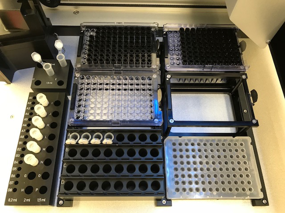

# GeneLab SOP for qPCR quantification of Illumina sequencing libraries #
Document No.: GL-SOP-6.1  
Version: 1.0  
Created: 08_21_2018  
Last revised: 02_24_2020  
Last revised by: Valery Boyko  

## Purpose/Scope: ##
This SOP describes the steps used by NASA GeneLab for qPCR quantification of Illumina
Sequencing libraries using a QIAgility.

## Equipment: ##
1. Qiagen 990512 Conducting filter-tips, 50 ul (960)
2. 96-well semi skirted plate
3. Tabletop centrifuge and vortex mixer

## Reagents: ##
1. Kapa KK4873 – 07960336001 ROX Low qPCR Master Mix
or
Kapa KK4824 – 07960140001 Universal qPCR Master Mix
2. These both contain DNA standards (1-6), Primer Mix (1 mL), KAPA SYBR® FAST qPCR
Master Mix (5 mL). The universal contains ROX High and ROX Low to be added separately,
the ROX Low has the ROX Low already added.
3. Library pool(s) diluted to 1:10,000, 1:20,000, 1:100,000, 1:200,000 according to GL-SOP-
002.2 in 1.5 ml tapered tubes

**For 1 library pool:**
Requires 34, 50 ul tips  
650 ul 2x Mix  
70 ul water  
41 ul each of 6 standards  
30 ul each of 4 dilutions  

**For 2 library pools:**  
Requires 46, 50 ul tips  
866 ul 2x Mix  
70 ul water  
41 ul each of 6 standards  
30 ul each of 4 dilutions of each library  
**For 3 library pools:**  
Requires 58, 50 ul tips  
1085 ul 2x Mix  
70 ul water  
41 ul each of 6 standards  
30 ul each of 4 dilutions of each library  
**For 4 library pools:**  
Requires 70, 50 ul tips  
1303 ul 2x Mix  
70 ul water  
41 ul each of 6 standards  
30 ul each of 4 dilutions of each library  

## Procedure: ##
1. Thaw all components at room temperature for 15 min.
2. Vortex all components until well mixed.
3. Centrifuge until all droplets are collected.
4. Set-up QIAgility deck:

M1: Master Mix Block:  
  648 (or appropriate volume) 2x reaction mix in tapered tube in position B  
  70 ul water in tapered tube in position C  

A1: 50 ul conductive tips  
A2: (optional): 200 ul conductive tips  
B1: (optional): 50 ul conductive tips  
B2: (optional): 50 ul conductive tips  

R1: Reagent block with 41 ul of each standard in position A - F  

C1: Flip cap block with 30 ul of each library dilution at A1 - A4 (continuing in groups of 4 with more libraries)  

C2: 96 sample qPCR plate  

### Set-up QIAgility ###
5.	Start the QIAgility set-up manager.
6.	Click on the appropriate template (e.g. 1 Lib Quant).
7.	Click Assignment and select 3 for the number of replicates and then click assign.
8.	Click Worktable.
9.	Click each gold worktable box and confirm loading.
10.	Click the green Start run button to begin the run.
11.	Following the run, generate a report and save in the Reports folder.

### Clean-up QIAgility ###
12.	Remove samples, standards and reagents from QIAgility deck and store or dispose of them properly.
13.	Close the lid.
14.	Turn off QIAgility by clicking File > Exit and following prompts.
15.	Turn off the computer.

### Run qPCR ###
16.	Seal the plate (*details TBD*).
17.	Run the qPCR (*details TBD*).
18.	Analyze the data (*details TBD*).

