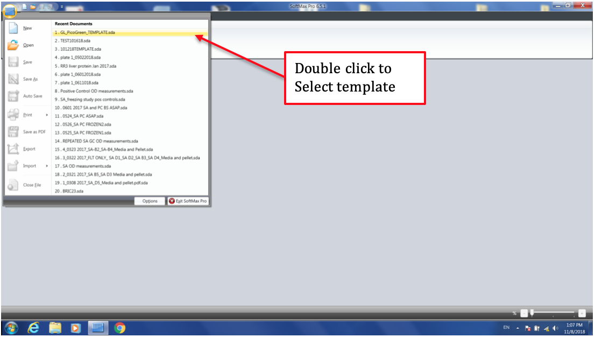
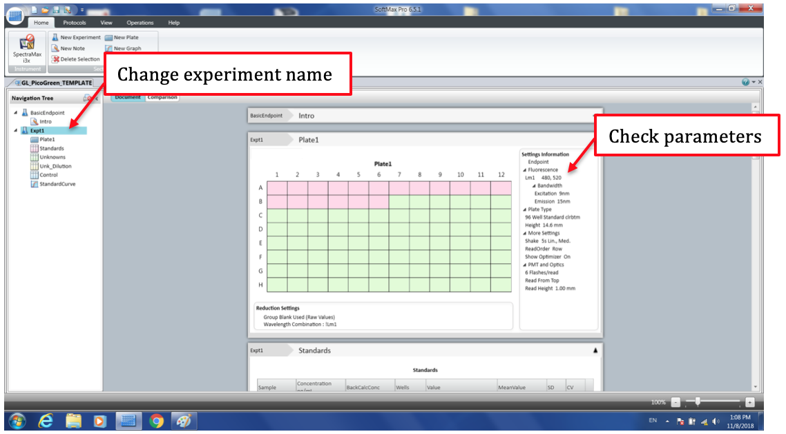
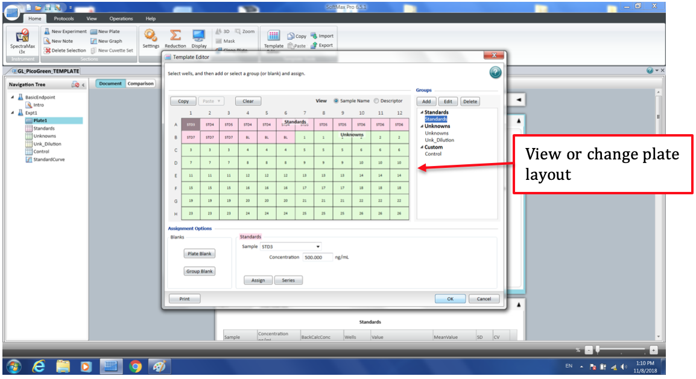
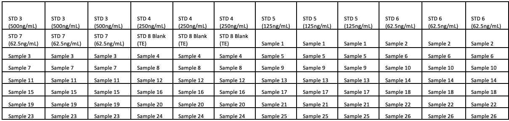

# GeneLab SOP for Quant-iT PicoGreen dsDNA Quantification of Illumina Sequencing Libraries #
Document No.:	GL-SOP-6.2  
Version:	1.0  
Created:	09_18_2018  
Last revised: 	02_24_2020  
Last revised by:	Yi-Chun Chen  

## Purpose/Scope: ##
This procedure lists the steps for dsDNA quantification of sequencing libraries using the Quant-iT™ PicoGreen™ dsDNA Assay Kit.

## Equipment: ##
1.	96-well flat bottom optical plate
2.	Vortex mixer that can hold 96 well plates
3.	Centrifuge that can hold 96 well plates

## Reagents: ##
1.	Quant-iT™ PicoGreen™ dsDNA Assay Kit – P11496 (Kit contains Quant-iT PicoGreen dsDNA reagent, 20X TE, and DNA standard).

**For 100 reactions to quantify up to 26 samples use:**
55 uL dye  
30 mL 1X TE  
300 ul each of diluted samples  
300 ul each of the standards  

## Procedure: ##
1.	Thaw all components at room temperature for 15 min. Protect dye from light.
2.	Prepare 1X TE by mixing 1.5 mL 20X TE to 28.5 mL water.
3.	Prepare 1X dye (200-fold dilution) by mixing the following:  
  a.	For 100 reactions: 55 uL dye + 10.945 mL 1X TE (Final volume: 11mL)  
4.	Prepare DNA standard (2 uG/mL) from stock (100 ug/mL). Adjust dilution if using stock with different concentration.  
  a.	Standard 1: Mix 10 uL stock DNA + 490 uL of 1X TE  
5.	Make 6 DNA standard as follows (2X serial dilution). Vortex between each standard.  
  a.	Standard 2: 400 uL of 2 ug/mL DNA stock + 400 uL of TE (1 ug/mL)  
  b.	Standard 3: 500 uL of STD 2 + 500 uL of TE (500 ng/mL)  
  c.	Standard 4: 500 uL of STD 3 + 500 uL of TE (250 ng/mL)  
  d.	Standard 5: 500 uL of STD 4 + 500 uL of TE (125 ng/mL)  
  e.	Standard 6: 500 uL of STD 5 + 500 uL of TE (62.5 ng/mL)  
  f.	Standard 7: 500 uL of STD 6 + 500 uL of TE (31.25 ng/mL)  
  g.	Standard 8: 500 uL of TE (Blank)  
6.	Dilute all test samples 100-fold in 1X TE, mix well.  
  a.	4 uL of samples + 396 uL of 1X TE  
7.	Load 3X 100 uL of standards 3-8 and samples onto the optical plate. See below for plate layout.
8.	Add 100uL of the working dye to each well. Mix gently with pipette.
9.	Seal plate with aluminum foil, vortex until well mixed.
10.	Centrifuge the plate to collect droplets. Measure after 5 min incubation.

**Measure with plate reader (excitation ~480nm, emission ~520nm)**
1.	Turn on SpectraMax i3x and connect to the computer.
2.	Open SoftMax Pro 6 on the computer.
3.	Click on the plate icon -> double click on “GL_PicoGreen_TEMPLATE.sda” to open template-> Right click on Expt1 and give the experiment a new name -> Use the “save as” function to save to a new file.

4.	Check to make sure all the parameters are correct. 
 
 

5.	Click on “Template Editor” to view or change plate layout.

6.	Click “Read” to read the plate.
7.	If reading more than 1 plate, click on “New Experiment” at the top. Change the experiment name to distinguish between different plates.

Sample plate layout

