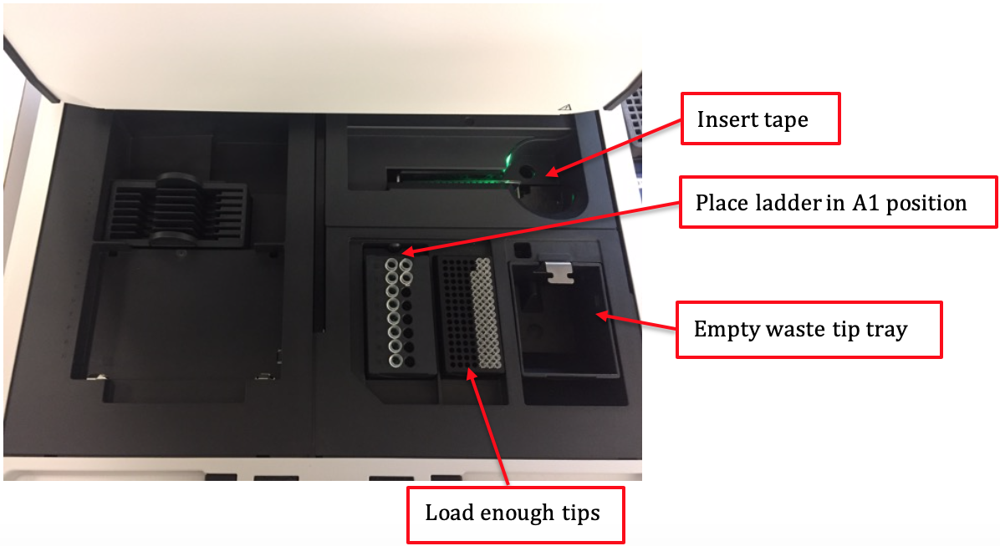
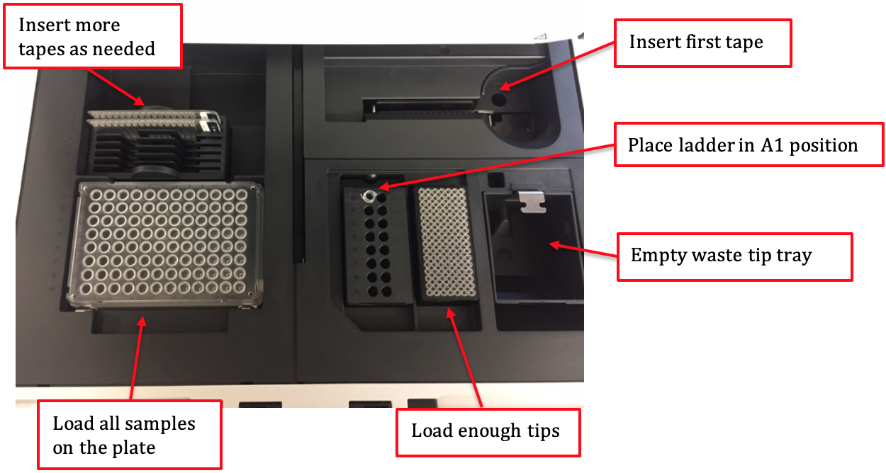

# GeneLab SOP for QC cDNA #
Document No.:	GL-SOP-6.3  
Version:	1.0  
Created:	10_04_2018  
Last revised: 	02_24_2020  
Last revised by:	Shyamli Narang  

## Purpose/Scope: ##
This procedure lists the steps for DNA quantification of sequencing libraries using an Agilent D1000 TapeStation.

## Equipment: ##
1.	Vortex mixer IKA MS3 with adapter
2.	Centrifuge that can hold 96 well plates
3.	Foil seal
4.	Agilent Loading Tips – 5067-5598
5.	8-strip PCR tubes or 96-well plate

## Reagents: ##
1.	Agilent D1000 DNA ScreenTape – 5067-5582. Stored at 4°C.
2.	Agilent D1000 DNA Reagents – 5067-5583. Including D1000 DNA Sample Buffer and D1000 ladder. Stored at 4°C.
3.	cDNA samples

**For 1- 15 samples:**  
3 ul 1000DNA Sample Buffer per sample  
1 ul D1000 ladder  
1 ul each of cDNA samples  
1X D1000 DNA ScreenTape  
Up to 2X 8-strip PCR strips  

**For 16-95 samples:**  
3 ul D1000 DNA Sample Buffer per sample  
5 ul D1000 ladder  
1 ul each of cDNA samples  
Up to 6X D1000 DNA ScreenTape  
1X 0.2mL PCR tube  
1X 96-well plate  

## Procedure: ##
1.	Thaw all D1000 DNA Reagents and D1000 DNA ScreenTape at room temperature for 30 min.
2.	Vortex reagents and centrifuge to collect droplets.
3.	Prepare ladder:  
  a.	For 1 – 15 samples: pipette 3 ul D1000 DNA Sample Buffer and 1 ul D1000 Ladder at position A1 in a tube strip.  
  * If using electronic ladder, use A1 for sample analysis.  

    b.	For 16 or more samples: pipette 15 ul D1000 DNA Sample Buffer and 5 ul D1000 Ladder at position A1 in a PCR tube.  
  * If using electronic ladder, use A1 for sample analysis.  
  
4.	For each sample, pipette 3 ul D1000 DNA Sample Buffer and 1 ul DNA sample in a tube strip or 96-well plate.
5.	Apply foil seal to the sample plate and caps to the tube strips.
6.	Mix liquids in sample and ladder vials using the IKA vortex at 2000 rpm for 1 min.
7.	Briefly centrifuge to collect droplets.
8.	Set up TapeStation  
  a.	Launch the Agilent 4200 TapeStation Controller Software.  
  b.	Flick the D1000 DNA ScreenTape(s) and load into the 4200 TapeStation instrument. If running more than 15 samples, load more ScreenTapes into the instrument dock.  
    * If using an electronic ladder, 16 samples can be run.  
  
    c.	Place loading tips into the Agilent 4200 TapeStation instrument. Remove cap.  
    d.	Carefully remove caps of tube strips and foil seal. Load the sample strips or 96-well plate into the instrument. Make sure to place DNA ladder in position A1 on tube strip holder.   
    e.	Select required sample positions on the software. Label all samples as necessary.  
    f.	Click Start button to start the run.  
    g.	Following the run, generate a report using the Agilent TapeStation Analysis Software and save in the Reports folder.   

9.	Clean up TapeStation  
  a.	Remove samples, D1000 ladder and used ScreenTape from TapeStation and store or dispose properly. Unused ScreenTape can be stored at 4C and used within 14 days.  
  b.	Empty waste tip tray.  
  c.	Close lid.  
  
  #### Deck layout: ####
  For 1-15 samples: 
  
  
  
  For 16-96 samples:
  
  

