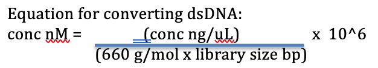
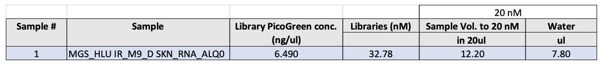

# GeneLab SOP for Normalizing TruSeq Stranded Total RNA Library #
Document No.:	GL-SOP-6.4  
Version:	1.0  
Created:	11_23_2018  
Last revised: 	12_28_2018  
Last revised by:	Marie Dinh  

## Purpose/Scope: ##
This SOP describes the steps used by NASA GeneLab to normalize TruSeq Stranded Total RNA libraries.

## Equipment: ##
1. TapeStation D1000

## Reagents: ##
1.   DNase- and RNAse-free water
2.   TruSeq Resuspension Buffer (RSB)
3.   TruSeq Total RNA library 
4.   Ice 
5.   Ice bucket
6.   Low bind microtube
7.  96-well sterile plate 
 
## Procedure: ##
1.	Obtain average library fragment size from TapeStation D1000 without adapter dimer if average size are within similar range -/+ 30 bp.  
2.	Convert each library concentration from PicoGreen measurement ng/uL to nM using average or individual fragment size bp.  (Reference PicoGreen SOP)

         
3.	Dilute each library to 20nM in DNAse-/RNase-free water.
4.	Store at -20°C for iSeq (GL-SOP-015.1) and NovaSeq run (GL-SOP-016.1).

