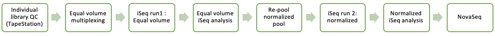

# GeneLab SOP for TruSeq Total RNA library Pooling, Normalization and QC #
Document No.:	GL-SOP-6.5  
Version:	1.0  
Created:	01_08_2019  
Last revised: 	04_10_2020  
Last revised by:	Valery Boyko  

## Purpose/Scope: ##
This SOP describes the steps used by NASA GeneLab to pool, normalize, and check the quality of TruSeq Total RNA libraries using an Agilent Tapestation and an Illumina iSeq.

## Reagents: ##
1.	Agilent D1000 DNA ScreenTape – (Cat#5067-5582, stored at 4°C)
2.	Agilent D1000 DNA Reagents – (Cat#5067-5583, stored at 4°C) Including D1000 DNA Sample Buffer and D1000 ladder. 
3.	Qubit dsDNA HS Assay Kit (Thermo Fisher Cat#Q32854/51) or Qubit 1X dsDNA HS Assay Kit (Thermo Fisher Cat#Q33231/30)
4.	8-strip PCR tubes or 96-well plate
5.	cDNA libraries
6.	Plate seals 
7.	Nuclease-Free water
8.	TruSeq Resuspension Buffer (RSB)
9.	Microplate centrifuge 
10.	Table top vortex
11.	Table to micro-tube centrifuge 
12.	1.5mL microtubes 
13.	1-2 N NaOH
14.	Tris-HCl pH 8.5
15.	Tris-HCl pH 8.0

## Procedure: ##

### Individual library QC: ###
This procedure describes how to obtain average library size [nt]. Average library size for each library in the planned multiplexed pool should be determined prior sample multiplexing. +/-60nt is tolerated, if the distribution is more spread out, expect the shorter fragments to cluster more abundantly to the flow cell.  
It is best to perform this step on the day that the library construction is completed.    

1.	Take out all Agilent D1000 TapeStation components and let equilibrate to room temperature for 30min: Screen Tape, Sample Buffer and Sample Ladder (optional). 
2.	Only work with cDNA libraries when fully thawed.  
  a.	To thaw, place the plate on ice for 10-20min.  
  b.	Make sure the adhesive foil is tightly attached to the plate and vortex the plate.  
  c.	To avoid cross contamination, spin the plate using a microplate centrifuge before removing the adhesive cover.  
3.	Follow SOP#004. 
4.	Record the average fragment size and the estimated sample concentration in the experiment master-sheet. 
5.	Use the estimated sample concentration [nG/uL] and average library size [nt] to convert the values to molarity [nM]. Use the following formula: 

6.	Assess the spread of the library concentrations in the pool by calculating the least concentrated library and the most concentrated library. 
7.	Calculate average library size [nt], it will be used to assess the pool molarity. 

*Note: TapeStation is not an accurate measure of quantity for dsDNA libraries. It’s only acceptable for this workflow that combines iSeq sequencing and individual library clustering ability for pool normalization.*

### Creating equal volume library pool: ###
1.	Make sure all the libraries that need to be multiplexed are thawed:  
  a.	To thaw, place the plate on ice for 10-20min.  
  b.	Make sure the adhesive foil is tightly attached to the plate and vortex the plate.  
  c.	To avoid cross contamination, spin the plate using a microplate centrifuge before removing the adhesive cover.  
2.	Combine 2uL of each library in to a 1.5mL tube.  
  a.	If working with many plates, use a multi-channel pipette and 8-tube strip to combine 2uL of each plate row. Combine the content of the 8-tube strip into one 1.5mL tube.  
  b.	Create a pool for each plate.  
  c.	Combine all pools.  
3.	Label the tube clearly.
4.	Gently vortex the equal volume pool and place on ice until use.
5.	Safely seal the library plates with adhesive seal and store at -20°C for later use. 

### iSeq run 1 - Equal volume pool: ###
1.	Follow iSeq User Guide to properly thaw the sequencing cartridge:

          
2.	Make sure RSB buffer is at room temperature prior use.
3.	To measure the pool concentration, use Qubit dsDNA HS or Qubit 1X dsDNA HS reagent. 
4.	Record pool concentration; deduct 20% from the value given by Qubit. 
5.	Use previously calculated average fragment size and Qubit concentration -20% to calculate pool molarity following the formula:
 
 
  
6.	Take out the iSeq 100 Flow Cell from 4°C storage. 
7.	Use “Loading conc calculator” for help with calculating dilution and:  
  a.	Dilute the normalized library pool to 1nM with RSB buffer in a low bind 1.5mL microtube. Vortex and spin down.   
  b.	Dilute the normalized library pool to loading concentration (50pM for TruSeq Total RNA kit) with RSB buffer in a low bind 1.5mL microtube. Vortex and spin down.  
  c.	Dilute PhiX control to same loading concentration (50pM) and add 1% to the library pool.   
8.	Follow the iSeq user guide and SOP#022 Sequencer Set Up to load the library on to the sequencer. 
9.	Safely store the remaining PhiX and the library pools in -20°C. 

### Normalized iSeq analysis: ###

1.	Transfer BCL files from the iSeq to the processing computer.
2.	Perform BCL2FASTQ conversion.
3.	Perform HTStream (follow “To_generate_HTStream_iSEQ-QC-report_on_MMOC_20190930”) to obtain:
  a.	%\_total\_reads value – clustering percentage of the library.
  b.	%\_Mus\_rRNA – percentage of the ribosomal RNA. 
  
4.	Open “Use_iSeq_HTStream_output_to_calculate_library_pooling_values” and read the “READ ME” tab. 
5.	Follow instructions on sheet titled “Balanced_pool_read_estimate” to estimate the reads/sample for the subsequent NovaSeq run.
6.	If the pool is balanced and the desired amount of reads/sample is reached, proceed to NovaSeq run. 

