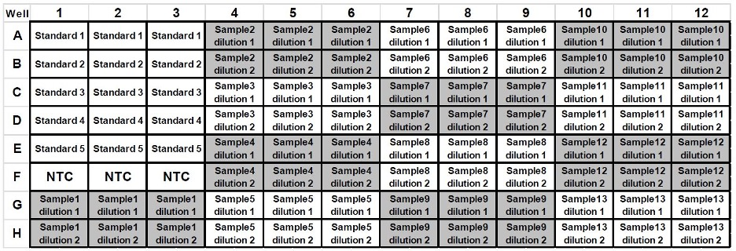

# GeneLab SOP for sequencing library quantification using QIAseq Library Quant Assay #
Document No.:	GL-SOP-6.7  
Version:	1.0  
Created:	10_15_2021  
Last revised: 	10_15_2021    
Last revised by:	Lovorka Degoricija 

#
## Purpose/Scope ##

This SOP follows the [QIAseq Library Quant Assay Handbook](https://www.qiagen.com/us/resources/resourcedetail?id=4b848546-96d0-4305-b1a8-4ef1b7408500&amp;lang=en) to quantitate Next Generation Sequencing libraries. It is strongly advised to read this document in full before using the SOP.

#
## Equipment

1. Eppendorf Centrifuge 5804 (Eppendorf Cat # 022622501 or similar)
2. Bench top microcentrifuge to accommodate 1.5mL tubes (Thermo Scientific Cat #75004081 or similar)
3. DNA LoBind Microcentrifuge Tubes 1.5mL (Thermo Scientific, Cat #13-698-791 or similar)
4. QuantStudio™ 6 Flex Real-Time PCR System (Thermo Fisher Cat # 4485697 or similar)
5. MicroAmp™ EnduraPlate™ Optical 96-well fast clear reaction plates (Thermo Fisher Cat # A36930 or similar)
6. MicroAmp Optical Adhesive Film, 100 covers (Fisher Scientific Cat # 43-119-71 or similar)

#
## Reagents

1. QIAseq Library Quant Assay Kit (Cat # 333314)

#
## General Practices and Notes

1. Carefully read the [QIAseq Library Quant Assay Handbook](https://www.qiagen.com/us/resources/resourcedetail?id=4b848546-96d0-4305-b1a8-4ef1b7408500&amp;lang=en)before proceeding with this SOP.
2. Physically separate the workspace for PCR setup and post-PCR work.
3. Before setting up an experiment, decontaminate the PCR workspace and labware (pipet barrels, tube racks, etc.) with 10% bleach and UV light. A PCR workstation is the preferred method for setting up qPCR reactions.
4. Make sure to open tubes containing PCR product in an area physically separated from the PCR setup. Close all tubes containing PCR products as soon as possible after use.
5. Do not vortex reactions or reagents unless instructed to do so.
6. Remove enzymes from -20°C freezer only when ready for use and immediately place them back in a -20°C freezer when finished.
7. For accuracy and precision, ensure that micro pipettors are calibrated before beginning the protocol. Be sure not to introduce bubbles into the wells when pipetting.
8. **Do not use DEPC-treated water.** Use high-quality, nuclease-free water.
9. If precipitates are present in the master mix tubes, warm the reagents at 42°C for 1 min and vortex briefly to dissolve. Repeat if necessary.
10. Refer to the [QIAseq Library Quant Assay Handbook](https://www.qiagen.com/us/resources/resourcedetail?id=4b848546-96d0-4305-b1a8-4ef1b7408500&amp;lang=en)for ordering the appropriate configuration of the assay kit.

#
## Procedure

1. Thaw Illumina DNA Standard on ice.
2. Prepare five sequential 10-fold dilutions from Illumina DNA Standard in dilution buffer using PCR tubes or strips as described in Table 1 below.

**Note:** Keep all components on ice and pipette mix the RNase Inhibitor and EZ Reverse Transcriptase. All other components can be vortexed.

Table 1: Illumina DNA Standard dilution.

| **Component** | **Illumina DNA Standard** | **Dilution buffer vol (uL)** |
| --- | --- | --- |
| **Std 1** | 5 uL undiluted | 45 |
| **Std 2** | 5 uL Std 1 | 45 |
| **Std 3** | 5 uL Std 2 | 45 |
| **Std 4** | 5 uL Std 3 | 45 |
| **Std 5** | 5 uL Std 4 | 45 |

3. Prepare a starting 1:20 dilution of the sample library in dilution buffer (1 uL of sample library + 19 uL dilution buffer). Pipette up and down 12 times to mix.
4. Prepare two working dilutions of the sample library, Dilution 1 and Dilution 2, as indicated in Table 2.

**Note:** Always use freshly made dilutions.

Table 2: Sample library dilution

| **Dilution** | **Library** | **Dilution buffer** |
| --- | --- | --- |
| **Dilution 1 (1:2000)** | 2 uL 1:20 | 198 uL |
| **Dilution 2 (1:20000)** | 5 uL 1:2000 | 45 uL |

5. Briefly centrifuge the SYBR Green Mastermix (10–15 s) to bring the contents to the bottom of the tube.

**Note:** Because SYBR Green Mastermix contains HotStarTaq® DNA Polymerase, which is heat-activated, reactions can be prepared at room temperature (15–25 **°** C).

6. Make PCR reaction master mix according to Table 3. Scale up according to the number of reactions. Add 10% overage to ensure enough mastermix for all samples. Pipette up and down 10 times to mix.

Table 3: Setup of qPCR mastermix.

| **Component** | **Volume (uL for 1X reaction)** |
| --- | --- |
| **Nuclease free water** | 8.5 |
| **SYBR Green Mastermix** | 12.5 |
| **Primer mix (10 uM)** | 1 |

7. Aliquot bulk mastermix, distributing the entire mastermix into a single strip of PCR tubes.
8. Add 3 uL of template (standard, dilution 1 sample, dilution 2 sample) and NTC to a 96 well plate designed for your Real-Time PCR System as shown in Figure 1.

**Note:** Add each template and NTC in triplicate.

Figure 1: QIAseq Library Quant Assay Kit layout (96-well plate)

9. Using a multi-channel pipettor, pipette 23 uL of mastermix created in step 6 above into each of the wells containing template or NTC. Pipette up and down 10 times to mix.

**Note:** Try to avoid creating bubbles when pipette mixing.

10. Carefully, tightly seal the plate with Optical Adhesive Film.

**Note:** Follow instructions on the [QIAseq Library Quant Assay Handbook](https://www.qiagen.com/us/resources/resourcedetail?id=4b848546-96d0-4305-b1a8-4ef1b7408500&amp;lang=en)for details regarding the appropriate seal to use with the specific Real-Time PCR System.

11. Centrifuge the plate for 30 seconds at 1000 x g at room temperature to remove any visible bubbles.

**Note:** Carefully inspect the wells for the presence of bubbles, as they will interfere with results.

12. Place the plate on ice while setting up the PCR cycling program.

**Note:** The plates containing PCR components may be stored at -20°C wrapped in aluminum foil for up to one week.

13. Program the Real-Time PCR System as shown in Table 4 below.

**Note:** Follow instructions on the [QIAseq Library Quant Assay Handbook](https://www.qiagen.com/us/resources/resourcedetail?id=4b848546-96d0-4305-b1a8-4ef1b7408500&amp;lang=en)for details regarding the appropriate cycling condition for each Real-Time PCR System.

Table 4: Cycling conditions for Applied Biosystems, Bio-Rad, Stratagene and Eppendorf cyclers

| **Cycles** | **Duration** | **Temperature** | **Comments** |
| --- | --- | --- | --- |
| **1** | 10 min | 95°C | HotStarTaq DNA Polymerase is activated by this heating step |
| **30** | 15 sec | 95°C |
|  | 30 sec | 60°C |
|  | 2 min | 72°C | Perform fluorescence data collection |

14. Place the plate in the Real-Time PCR System. If recommended by the Real-Time PCR System user manual, use a compression pad for a plate sealed with optical adhesive film.
15. Download the [QIAseq Library Quant Assay Kit Excel-based data analysis](https://www.qiagen.com/us/products/discovery-translational-research/dna-rna-purification/dna-sample-technologies/genomic-dna/qiaseq-library-quant-system/#resources/) file that corresponds to the plate format used.
16. Follow the instructions on the excel data analysis file or the [QIAseq Library Quant Assay Handbook](https://www.qiagen.com/us/resources/resourcedetail?id=4b848546-96d0-4305-b1a8-4ef1b7408500&amp;lang=en)to calculate the library concentration in nM.
