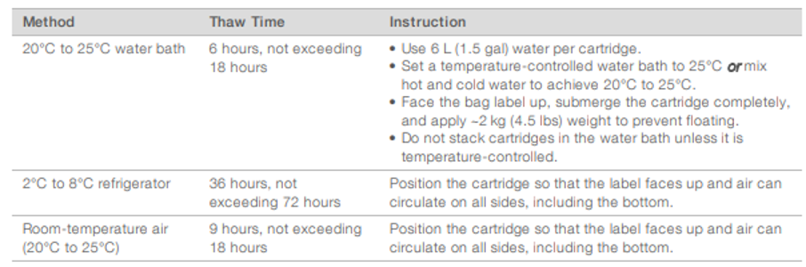
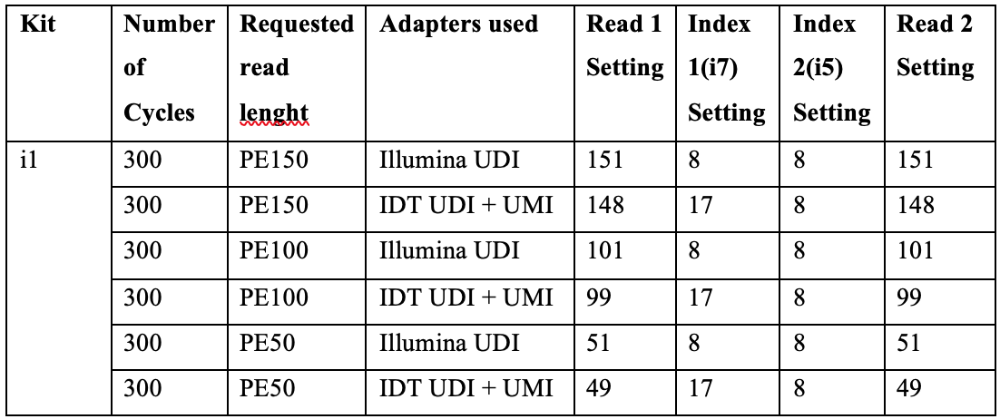
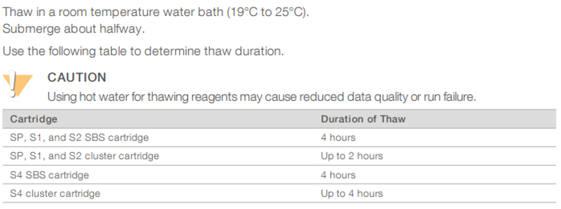
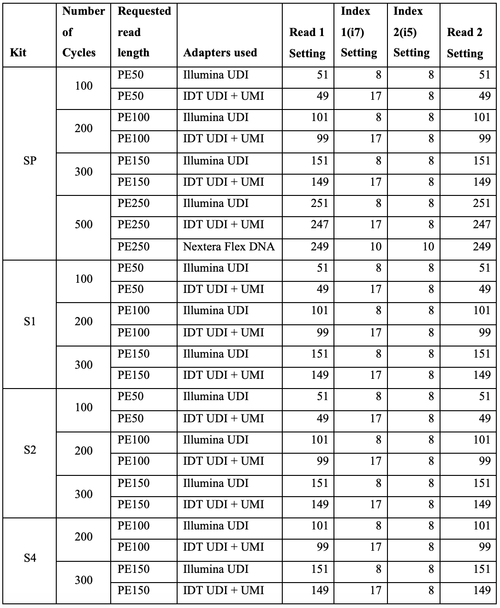
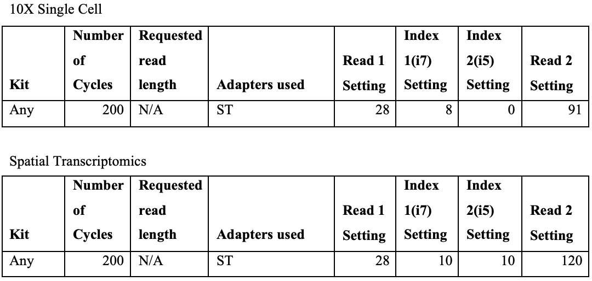

# GeneLab SOP for Setting up NovaSeq 6000 and iSeq 100 Sequencers  #
Document No.:	GL-SOP-7.1  
Version:	1.0  
Created:	03_30_2020  
Last revised: 	03_30_2020  
Last revised by:	Valery Boyko  

### Purpose/Scope: ###
  * If setting up iSeq 100 sequencer refer to procedure A.
  * If setting up NovaSeq 6000 sequencer refer to procedure B.

**_This SOP only describes the set-up of the sequencer, for all the other procedural details; make sure to read the most updated System Guides and the proper SOP’s._**

## Procedure A (iSeq 100) ##

### Reagents: ###
1.	iSeq 100 i1 Cartridge (Stored at -20°C) 
2.	iSeq 100 i1 Flow Cell (Stored at 4°C) 
3.	Consumables required for library dilution and spike in

### Procedure: ###
1.	Thaw the iSeq cartridge and the flow cell according to the System Guide 

Flow cell should be at room temperature at the time of sequencer loading. 

2.	Prepare SampleSheet file. Make sure to use the right configuration of i5 index (Index2). 
3.	Dilute the multiplexed library and spike the PhiX control according to the experimental design, dilute the spiked pool to loading concentration.
4.	Load the library pool onto the cartridge following the System Guide.
5.	Set up the sequencing run.

**Local Run Manager mode:**  
  a.	Open iSeq Control Software.  
  b.	Select Local Run Manager -> Open Local Run Manager.  
  c.	Create a sequencing run by Importing a sample sheet.  
  d.	Save run.  
  e.	In the control software, select “Sequence”. The Software will open the sequencer door and eject the tray.  
  f.	Place the sequencing cartridge with the flow cell and diluted, spiked library onto the tray.  
  g.	Select Close Door, the tray will retract and the door will close.  
  h.	If does not appear automatically, select the previously created run from the “Run Name” list. Try Refreshing if the run is missing.  
  i.	Make sure the read length parameters for Read 1, Index 1, Index 2, Read 2 fit with the planned experimental design:  

  j.	Make sure to record/take an image of the run set up window.  
  k.	Select Start Run.  
  l.	When run is finished, dispose of the used reagents according to the safety regulations.  

**Manual mode (without SampleSheet and Local Run Manager):**   
  a.	Open iSeq Control Software.  
  b.	In the control software, select “Sequence”. The Software will open the sequencer door and eject the tray.  
  c.	Place the sequencing cartridge with the flow cell and diluted, spiked library onto the tray.  
  d.	Select Close Door, the tray will retract and the door will close.  
  e.	In the “Run Name” field, enter a unique name, make sure to include the date, the project and any other information that might be useful in identifying this run.  
  f.	Select “Single Read/Dual Read” option.  
  g.	Enter the number of cycles to perform in each read following the planned experimental design.  

  h.	Make sure to record/take an image of the run set up window. 
  i.	Select Start Run. 
  j.	When run is finished, dispose of the used reagents according to the safety regulations.

## Procedure B (NovaSeq 6000) ##

### Reagents: ###
1.	NovaSeq 6000 SBS Cartridge (Stored at -20°C) 
2.	NovaSeq 6000 Cluster Cartridge (Stored at -20°C)
3.	NovaSeq 6000 Buffer Cartridge (Stored at RT) 
4.	NovaSeq 6000 Flow Cell (Stored at 4°C) 
5.	Consumables required for library dilution and spike in

## Procedure: ##
1.	Thaw the two NovaSeq cartridges and the flow cell according to the System Guide: 

Set the flow cell package aside at room temperature for 10-15 minutes to allow it to reach room temperature. 

2.	Empty used reagent bottles from the NovaSeq, dispose according to laboratory safety regulations. 
3.	Change gloves after handling waste.
4.	Prepare SampleSheet file. Make sure to use the right configuration of i5 index (Index2).
5.	Dilute the multiplexed library and spike the PhiX control according to the experimental design, denature and dilute the spiked pool according to the guide. 
6.	Inspect the SBS and the Cluster cartridges, invert 10 times and tap the bottom on the bench.
7.	Load the library into the library tube and insert into position #8 of the cluster cartridge.
8.	In the control software, select “Sequence” and then select a single or dual flow cell run
The flow cell door will open. 
9.	With new powder free gloves, unpack the flow cell and inspect for defects.
10.	Align the flow cell over the four raised clamps and place it on the flow cell stage.
11.	Select “Close Flow Cell Door.” 
12.	Load the SBS, Cluster and Buffer Cartridges. 
13.	Select Checkbox acknowledging that the used reagent bottles have been emptied.
14.	Select Run Setup button to enter run parameters.
15.	Select workflow type (Xp/Standard).
16.	In the “Run Name” field enter a unique name, make sure to include the date, the project and any other information that might be useful in identifying this run.
17.	Enter the number of cycles to perform in each read following the planned experimental design and the reagents used to make the libraries and sequence: 

18.	Select output folder. 
19.	Confirm the run parameters on the Review screen.
20.	Make sure to record/take an image of the run set up window. 
21.	Select “Start Run.”

