# GeneLab SOP for Generating iSeq QC complete report from HTStream on MMOC.  Scripts and instructions written by Amanda Saravia-Butler. #
Document No.:	GL-SOP-8.1  
Version:	1.0  
Created:	04_10_2020  
Last revised: 	04_10_2020  
Last revised by:	Marie Dinh  

## Purpose/Scope: ##

More info about genomic data pre-processing tool, developed by UC Davis’ Matt Settles can be found here: https://github.com/ibest/HTStream.   
There are three components used in the scripts for the complete report: hts_SeqScreener, hts_Stats and hts_SuperDeduper.   
rRNA fasta files retrieved from NCBI were used for human, mouse and bacterial rRNA calculations.  
Instructions below were written for paired-end reads with UMI adapters.  The instructions can be applied for single-end read using appropriate script in step 37.  
For no UMI adapters, skip steps 12-18.  

**Instructions to generate an iSEQ QC report for paired-end reads with HTStream on MMOC:**
* Note: all screen shots of my terminal are colored – yours will be a white background with black text (unless you change the settings for your terminal).

1.	Open a terminal window and log into MMOC using the following command:  
  $ ssh username@gene-hn.amn.nasa.gov  
  Type in your password when you’re prompted for it, then press Enter  

2.	Change into the SPL_iSeq directory using the following command:  
  $ cd /netapp/disk1/SPL_iSeq  

3.	In the folder ‘SPL_iSeq’ make a new folder for the iSEQ run you want to analyze by typing the command below.  
  $ mkdir RunName_iSeq_date_initals  

Note: The title of the folder cannot have any spaces or weird characters, see example below.  
For example: RR6_iSeq_20190617_ASB  

4.	Change into the directory you made in step 3 using the following command:  
  $ cd /netapp/disk1/SPL_iSeq/RR6_iSeq_20190617_ASB  

5.	Once in that directory, type the following command to view the direct path to that directory on MMOC:  
  $ pwd  
  In this example, you should see the following appear:  
  /netapp/disk1/SPL_iSeq/RR6_iSeq_20190617_ASB  

6.	Copy the entire directory that’s outputted from the iSeq run onto the Desktop of your computer.

7.	Open a new terminal window (note: you will not be logged into MMOC in this window).

8.	Copy the iSeq directory from your Desktop into the directory you made in step 3 on MMOC by typing the following command in the terminal window you opened in step 7.  
  $ scp -r ~/Desktop/iSeq_output_directory username@gene-hn.amn.nasa.gov:/path/to/directory/made/on/MMOC/in/step/3  
  Type in your MMOC password when you’re prompted for it, then press Enter
  Example:    
  $ scp -r ~/Desktop/20190617_FS10000323_13_BPC29610-1014 asaravia@gene-hn.amn.nasa.gov:/netapp/disk1/SPL_iSeq/RR6_iSeq_20190617_ASB  

  Note: This will take ~5-10 minutes (you’ll see your command prompt return when it’s done).  

9.	Return to the directory on MMOC you made in step 3 in the terminal window that’s logged into MMOC.

10.	Repeat step 5 to make sure you’re in the directory you made in step 3, then type the following command to check that the directory copied in step 8 is now in the directory on MMOC you made in step 3.  
  $ ls  
  In this example, you should see the following:  
  20190617_FS10000323_13_BPC29610-1014  

11.	While in the directory you made in step 3, make a directory for the bcl2fastq output using the following command:  
  $ mkdir out-name_of_iSeq_output_directory  
  Example:  
  $ mkdir out-20190617_FS10000323_13_BPC29610-1014  
  
  ***Steps 12 – 18 are only for iSeq runs that contain samples with UMIs***  
  ***If the iSeq run does NOT contain samples with UMIs, jump to step 19***

12.	We’ll have to change some info in the files in the iSeq output directory, so change into that directory by typing the following command:  
  $ cd name_of_iSeq_output_directory  
  Example:  
  $ cd 20190617_FS10000323_13_BPC29610-1014  

13.	Make copies of the files we will change to preserve the original file by typing the following commands:
  $ cp SampleSheet.csv SampleSheet_original.csv  
  $ cp RunInfo.xml RunInfo_original.xml  

14.	Open the SampleSheet.csv file using nano by typing the following command:
  $ nano SampleSheet.csv  
  You’ll see a window open that looks as follows:  

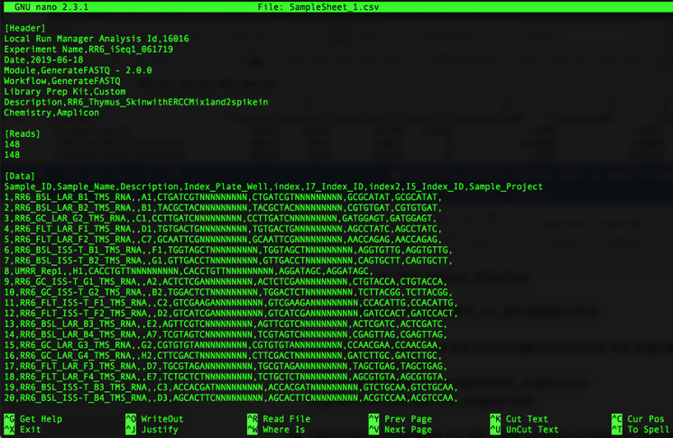

15.	Remove the string of N’s by doing the following:  
  Press ‘control’ and ‘\ ‘ at the same time, you’ll see the following:

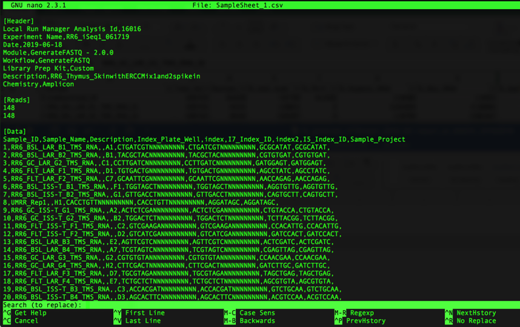

Note that you’ll get prompted for what you want to replace, type the following:  
NNNNNNNNN  

It will look like this in your window:  

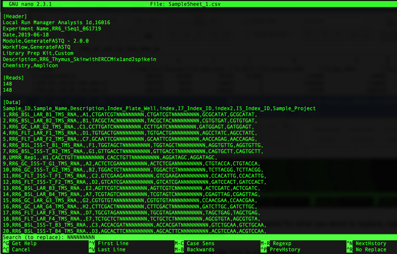

Then press ‘Enter’. You will now be prompted for what to replace the string of N’s with. It will look as follows:  

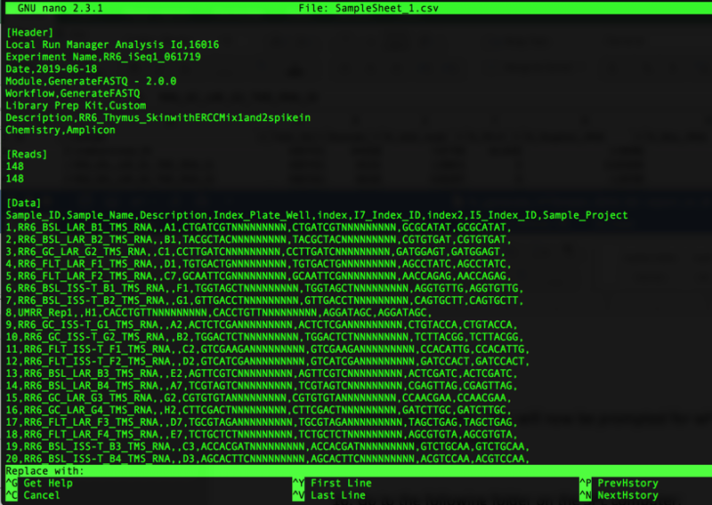

Since we want to remove the N’s (and not replace it with anything), just press ‘Enter’  
Next, you’ll be asked which string of N’s you want to replace (or, in our case, remove), as follows:

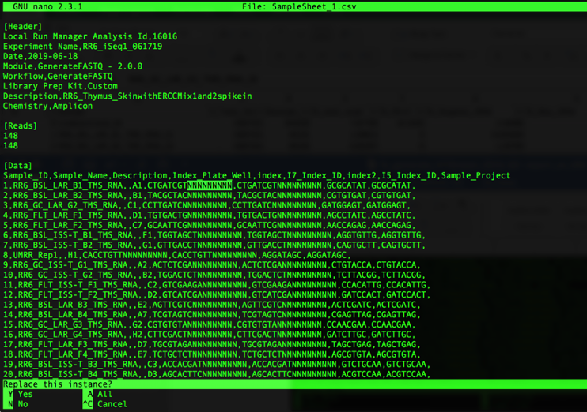

Press ‘a’ to remove all of the strings of N’s. Note that all of the N’s will be removed and it will show how many strings of N’s were replaced as follows:  

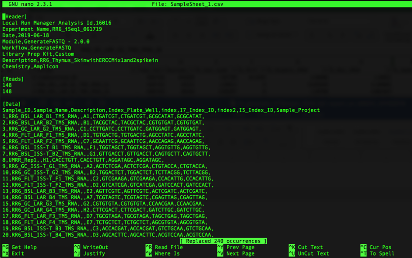

The number of occurrences replaced should be two times the number of samples; i.e. in the example above there are 120 samples so we see that 240 occurrences were replaced.

You can now save the changes you made by pressing ‘control’ and ‘x’ at the same time, which will then ask you if you want to save your changes as shown below:

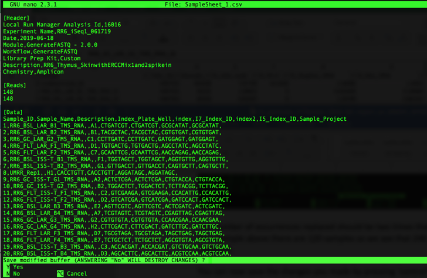

Press ‘y’ to save your changes and it will prompt you with the name of the file. Make sure it says SampleSheet.csv (as shown below) then press ‘Enter’

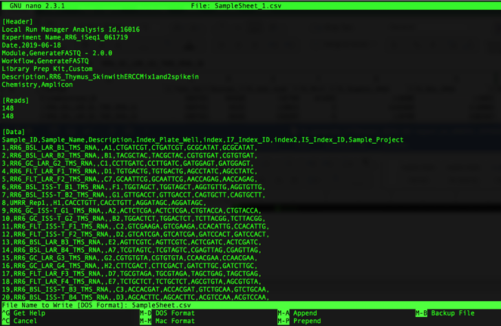

16.	Open the RunInfo.xml file using nano by typing the following command:
$ nano RunInfo.xml
You’ll see a window open that looks as follows:

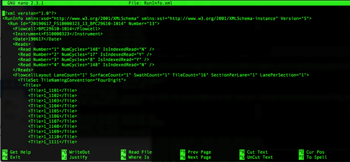

17.	Modify the Read Numbers by doing the following:
Add another Read Number line between Read Number=”2” and Read Number=”3” (note: you can do this by copying the Read Number=”2” line and pasting the copy below that line as follows):

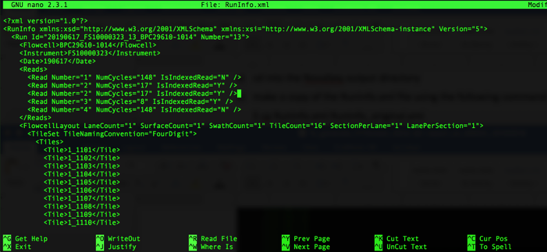

Next, you need to modify the info for each Read Number:  
They should be labeled 1-5.  
Read Number=”1” is your forward read, has a read length (aka NumCycles) of 148 and is not an indexed read.  
Read Number=”2” is your i7 index, has a read length (aka NumCycles) of 8 and is an indexed read.  
Read Number=”3” is your UMI read, has a read length (aka NumCycles) of 9 and is not an indexed read.  
Read Number=”4” is your i5 index, has a read length (aka NumCycles) of 8 and is an indexed read.  
Read Number=”5” is your reverse read, has a read length (aka NumCycles) of 148 and is not an indexed read.  

When modification is complete, it should look as follows:  

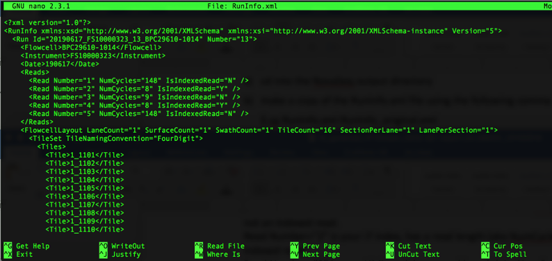

You can now save the changes you made by pressing ‘control’ and ‘x’ at the same time, which will then ask you if you want to save your changes as shown below:

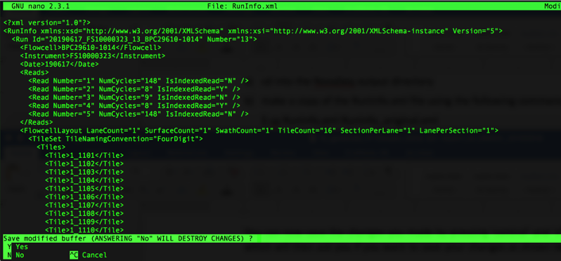

Press ‘y’ to save your changes and it will prompt you with the name of the file. Make sure it says RunInfo.xml (as shown below) then press ‘Enter’

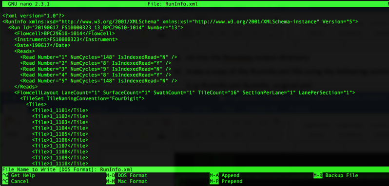

18.	Move up one directory to return to the directory you made in step 3 by typing the following command:  
  $ cd ..  

19.	Copy the bcl2fastq script into your current directory (the directory you made in step 3) by typing the following command:  
  $ cp /netapp/disk1/SPL_iSeq/iSeq_scripts/0_bcl2fastq.sh ./  

20.	Open the 0_bcl2fastq.sh script using nano by typing the following command:  
  $ nano 0_bcl2fastq.sh  
  You’ll see a window open that looks as follows:  

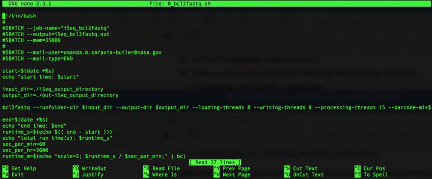

21.	Replace ‘iSeq_output_directory’ with the title of your iSeq output directory – in this example, it is: 20190617_FS10000323_13_BPC29610-1014  
When the modification is complete, it will look as follows:  

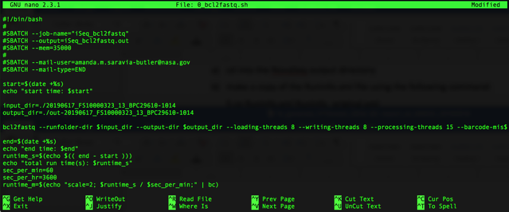

You can now save the changes you made by pressing ‘control’ and ‘x’ at the same time, which will then ask you if you want to save your changes as shown below:  

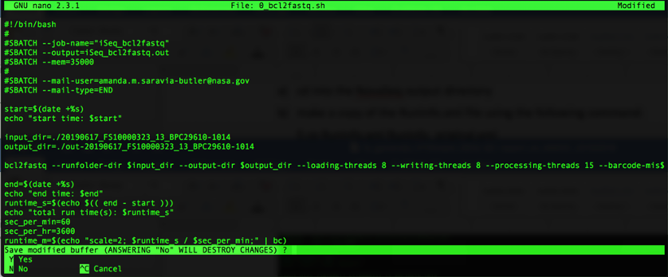

Press ‘y’ to save your changes and it will prompt you with the name of the file. Make sure it says 0_bcl2fastq.sh (as shown below) then press ‘Enter’

22.	You’re now ready to run bcl2fastq by typing the following command:  
  $ sbatch 0_bcl2fastq.sh  

23.	You can view the status of your job by typing the following command:
  $ squeue  
  You will see your job in the queue as follows:  

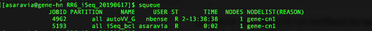

When your job is complete, you will no longer see it in the queue.

24.	After your job is complete, execute the ls command to see what’s in your directory. You should now see a file titled:  
  ‘iSeq_bcl2fastq.out’  

25.	Look at that file by typing the following command:  
  $ cat  iSeq_bcl2fastq.out  
  The end of that file should look like the following:  

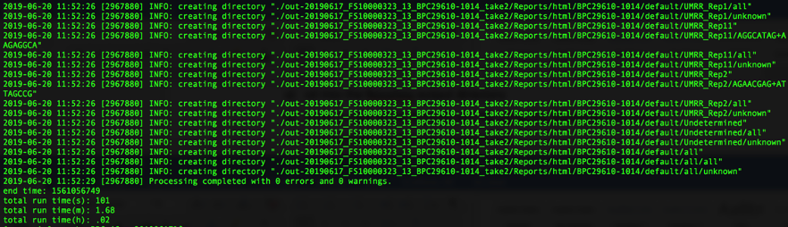

Note: You want to see that the “Processing completed with 0 errors and 0 warnings.”
If it says anything other than that, please let me know.

26.	Change directory into your bcl2fastq output directory by typing the following command:  
  $ cd out-iSeq_output_directory  
  In this example, the command looks as follows:  
  $ cd out-20190617_FS10000323_13_BPC29610-1014  

27.	Execute the ls command to view the bcl2fastq files and directories.  
  You should see two directories titled ‘Reports’ and ‘Stats’  
  For samples with UMIs: You should also see one R1, one R2, and one R3 fastq.gz file for each sample  
  For samples without UMIs: You should also see one R1 and one R2 fastq.gz file for each sample  

28.	Make sure all samples were converted to fastq files by typing (or copy and pasting) the following command:  
  $ ls -1 \_R1\_\* | wc -l    
The number that is outputted should be the number of samples plus 1 (the additional sample is undetermined). If you get less than that, there may be a mistake in the indices in the sample sheet for the sample(s) that do not have fastq.gz files.

29.	Make a ‘Fastq’ directory in your current directory (which should be the bcl2fastq output directory, out-20190617_FS10000323_13_BPC29610-1014 in this example) by typing the following command:  
  $ mkdir Fastq  

30.	Move all of your fastq.gz files into the Fastq directory you made in step 29 by typing the following command:  
  $ mv \*fastq.gz Fastq  

31.	Execute the ls command to view what’s in your bcl2fastq output directory. You should only see the following 3 directories:  
  ‘Fastq’, ‘Reports’, and ‘Stats’  

*Note* The following steps should look very familiar.

32.	Follow the instructions below to make a text file that contains a list of the samples you ran on the iSeq and save it as ‘samples.txt’ 

Go into the Fastq folder you generated in step 29 by typing the following command:  
  $ cd Fastq   
  You can also go into that folder using the direct path; for this example, it would be:  
  $ cd /netapp/disk1/SPL_iSeq/RR6_iSeq_20190617_ASB/out-20190617_FS10000323_13_BPC29610-1014/Fastq  
  Once there, type the following command to get a single column list of all your samples.  

 **Command:**  
  $ ls -1 \*\_R1\_\*  

**Copy that list!**
 Next, move up one folder so that you’re back in your bcl2fastq output folder (for this example, it would be out-20190617_FS10000323_13_BPC29610-1014) using the following command:  
  $ cd ..  
You can also go into that folder using the direct path; for this example, it would be:  
  $ cd /netapp/disk1/SPL_iSeq/RR6_iSeq_20190617_ASB/out-20190617_FS10000323_13_BPC29610-1014  

You will now use the nano text editor to make a samples.txt file by following the instructions below.

Type the following command to open the nano text editor:  
  $ nano  

The following will appear:

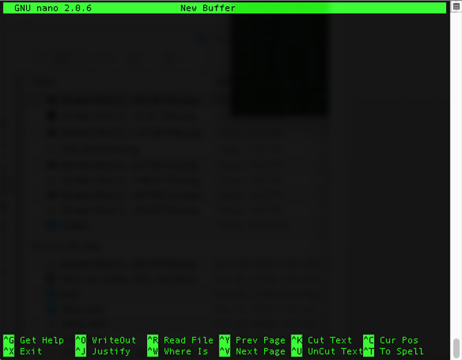

Paste the fastq file names that you copied above. It should look as follows: 

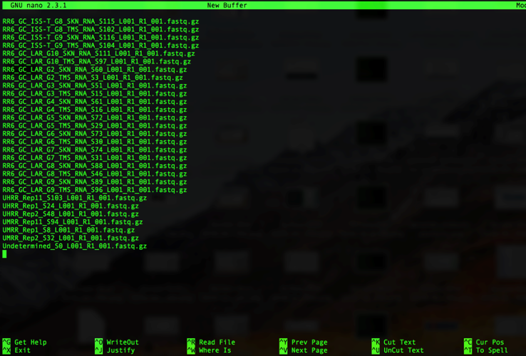

Remove everything that comes after the S# as follows:
Press ‘control’ and ‘\ ‘ at the same time, you’ll see the following:

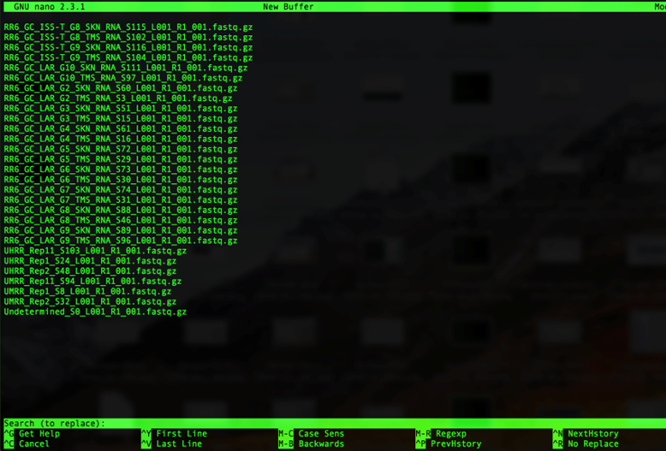

Note that you’ll get prompted for what you want to replace, type the following:
\_L001_R1_001.fastq.gz

It will look like this in your window:

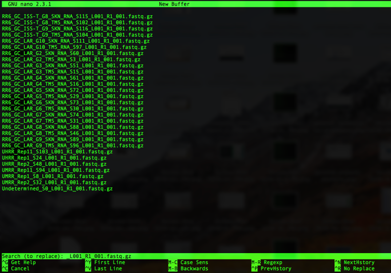

Then press ‘Enter’. You will now be prompted for what to replace \_L001_R1_001.fastq.gz with. It will look as follows:

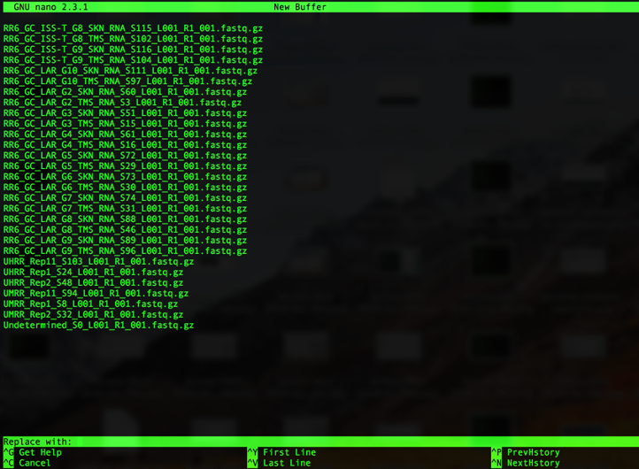

Since we want to remove \_L001_R1_001.fastq.gz (and not replace it with anything), just press ‘Enter’
Next, you’ll be asked which instance of \_L001_R1_001.fastq.gz you want to replace (or, in our case, remove), as follows:

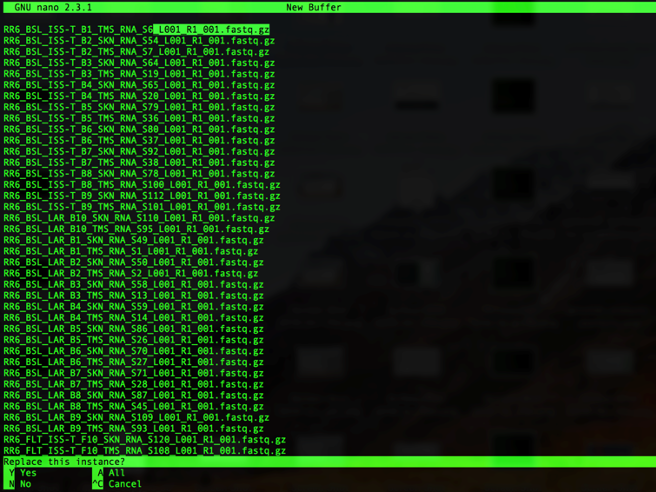

Press ‘a’ to remove all of the instances of \_L001_R1_001.fastq.gz. Note that all of the instances of \_L001_R1_001.fastq.gz will be removed and it will show how many instances of \_L001_R1_001.fastq.gz were replaced as follows:

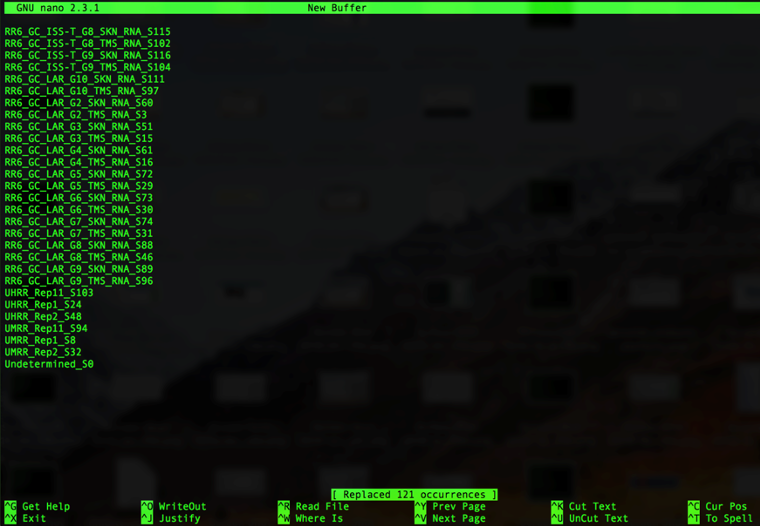

The number of occurrences replaced should be the number of samples plus one (for undetermined); i.e. in the example above there are 120 samples so we see that 121 occurrences were replaced.

You can now save the changes you made by pressing ‘control’ and ‘x’ at the same time, which will then ask you if you want to save your changes as shown below:

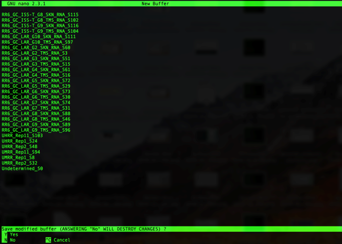

Press ‘y’ to save your changes and it will prompt you to name the file. Type ‘samples.txt’ as shown below then press ‘Enter’

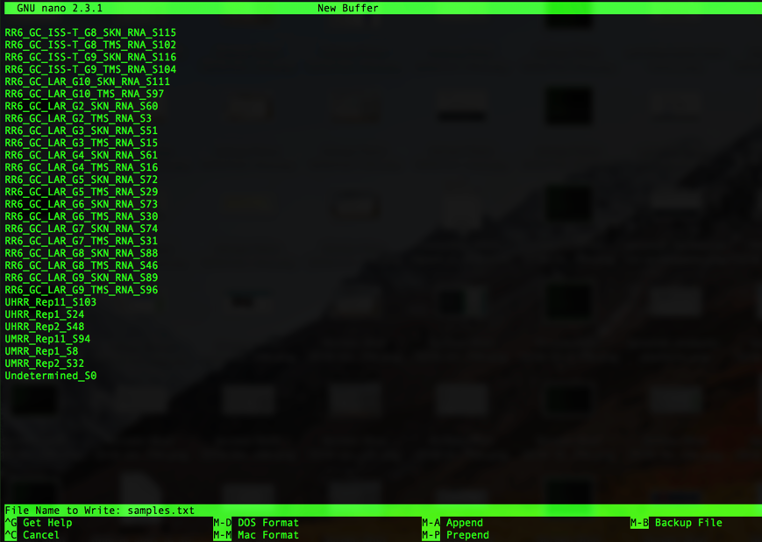

33.	Type the following command to check what’s in your folder.  
Command:  
  $ ls  

You should see the following in your bcl2fastq output folder:  
  ‘Fastq’, ‘Reports’, and ‘Stats’ directories and the ‘samples.txt’ file you created in step 32. 

34.	Type the following command to check your ‘samples.txt’ file.  
Command:  
  $ cat samples.txt  

Example:

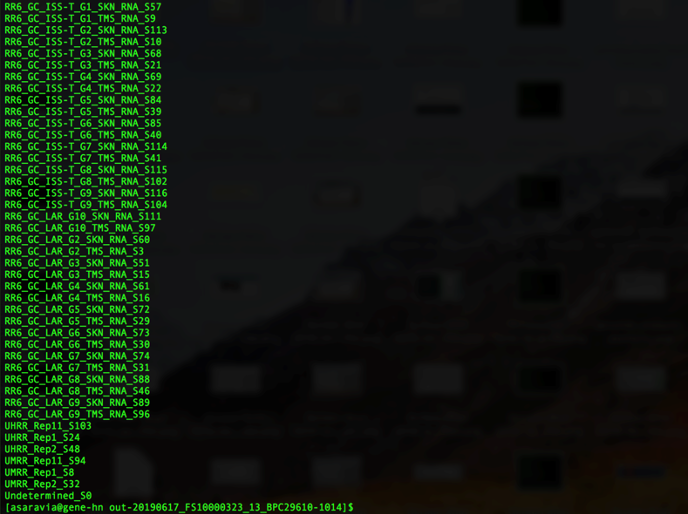

35.	Make the directories you will need for the HTStream analysis by typing the following command:  
  $ sbatch /netapp/disk1/SPL_iSeq/iSeq_scripts/make_directories.sh  

36.	Execute the ls command to see what changed. You should now see a directory titled ‘HTStream_output’ and a file titled ‘make_directories.out’ in addition to what’s listed in step 33.

37.	You are now ready to run the HTStream program. To do so, type the following command.  
Command (for PE samples with UMIs):  
  $ sbatch /netapp/disk1/SPL_iSeq/iSeq_scripts/1_HTStream_rRNA_SD_loop.sh  

Command (for PE samples without UMIs):  
  $ sbatch /netapp/disk1/SPL_iSeq/iSeq_scripts/1_HTStream_rRNA_SD_noUMI_loop.sh  

Command (for SE samples):  
  $ sbatch /netapp/disk1/SPL_iSeq/iSeq_scripts/1_HTStream_rRNA_SD_SE_loop.sh  

This will take less than 10min to run for iSeq data.

38.	To check the progress of your job, type the command below followed by enter.  
Command:  
  $ squeue  

Note: If the program is still running you will see it listed in the queue as shown below:

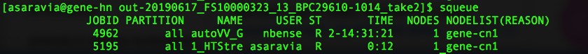

39.	Once complete, look at the end of the standard out file by typing the following command:  
  $ tail ./HTStream_output/1_out_files/1_HTStream.out  
  You should see something that looks like this:  

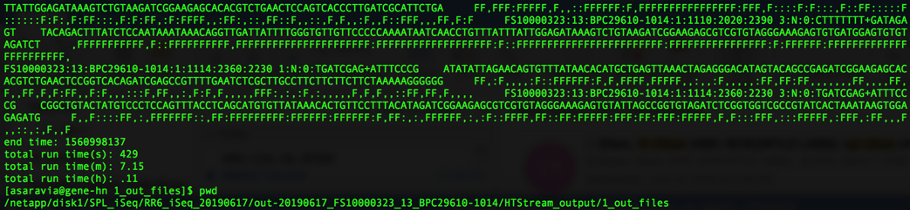

If you see anything different, please let me know.

40.	Once complete, there should be a .log file generated for each sample. To view the files that have been generated, use the following command.  
Command:  
  $ ls ./HTStream_output/1_log_files  

41.	Type the following command to calculate the total number of reads generated by the iSeq run.  
Command:  
  sbatch /netapp/disk1/SPL_iSeq/iSeq_scripts/2_calc_totalreads_loop.sh  

Note: This command will run very quickly (within seconds to a minute or two)

42.	To view the files generated, type the command below.  
Command:  
  $ ls HTStream_output/2_totreads  

* Note: You should see a .txt file for each sample and a ‘totalreads.txt’ file

43.	Use the totalreads.txt and .log files to generate a rRNA report for each sample by typing the command below.  
Command:  
  $ sbatch /netapp/disk1/SPL_iSeq/iSeq_scripts/3_make_rRNA_reports_loop.sh  

* Note: This command will run very quickly (within seconds to a minute or two) and will generate several .txt files

44.	To view the files generated, type the command below.  
Command:  
  $ ls HTStream_output/3_rRNA_reports  

* Note: You should see the following 2 txt files for each sample (the other two txt files per sample that are generated are in HTStream_output/3_tmp_files):  
  <sample_name>\_rRNA-report_tmp.txt  
  <sample_name>\_rRNA-report.txt  

Files in HTStream_output/3_tmp_files are as follows:  
  <sample_name>\_tmp.txt  
  <sample_name>\_.txt  

45.	Use the rRNA reports from each sample to generate a complete rRNA report containing all the info from all the samples by typing the command below.  
Command:  
  $ sbatch /netapp/disk1/SPL_iSeq/iSeq_scripts/4_make_complete_rRNA_report.sh  

Note: This command will run very quickly (within seconds) and will generate one additional .txt file

46.	Use the following command to see the output files that were generated from step 22:
Command:  
  $ ls HTStream_output  

* Note: You should see the following txt file (in addition to directories that contain outputs from the previous 4 commands):  
  complete_rRNA-report.txt  

47.	Move into the HTStream_output directory by typing the following command:  
  $ cd HTStream_output  

48.	Print the complete path using the pwd command. You should see the following:  
  /netapp/disk1/SPL_iSeq/iSeq_output_directory/bcl2fastq_output_directory/HTStream_output

In this example it will be:  
  /netapp/disk1/SPL_iSeq/RR6_iSeq_20190617_ASB/out-20190617_FS10000323_13_BPC29610-1014_take2/HTStream_output  

49.	Open a new terminal window (note: you will not be logged into MMOC in this window).

50.	Use the cd command to move into the directory that you want to copy the complete_rRNA-report.txt into on your computer. 

If you want to copy the report onto your desktop, type the following command to get to your desktop:  
  $ cd ~/Desktop  

Once there, type the following command:  
  $ scp username@gene-hn.amn.nasa.gov:/path/that’s/outputted/in/step/48/ complete_rRNA-report.txt ./  

In this example, it will be:  
  $ scp username@gene-hn.amn.nasa.gov:/netapp/disk1/SPL_iSeq/RR6_iSeq_20190617_ASB/out-20190617_FS10000323_13_BPC29610-1014_take2/HTStream_output/complete_rRNA-report.txt ./  

51.	Your command line work is now done. To view the complete_rRNA-report, go to your Desktop or the folder on your computer that you copied the complete rRNA report into (in step 50). Once in that folder, right click on the ‘complete_rRNA-report.txt’ file and open with Microsoft excel. You will see a table appear that looks like the rRNA reports I have sent you. Go ahead and save that as a .xlsx file (and re-name it) so that you can make and save changes.

