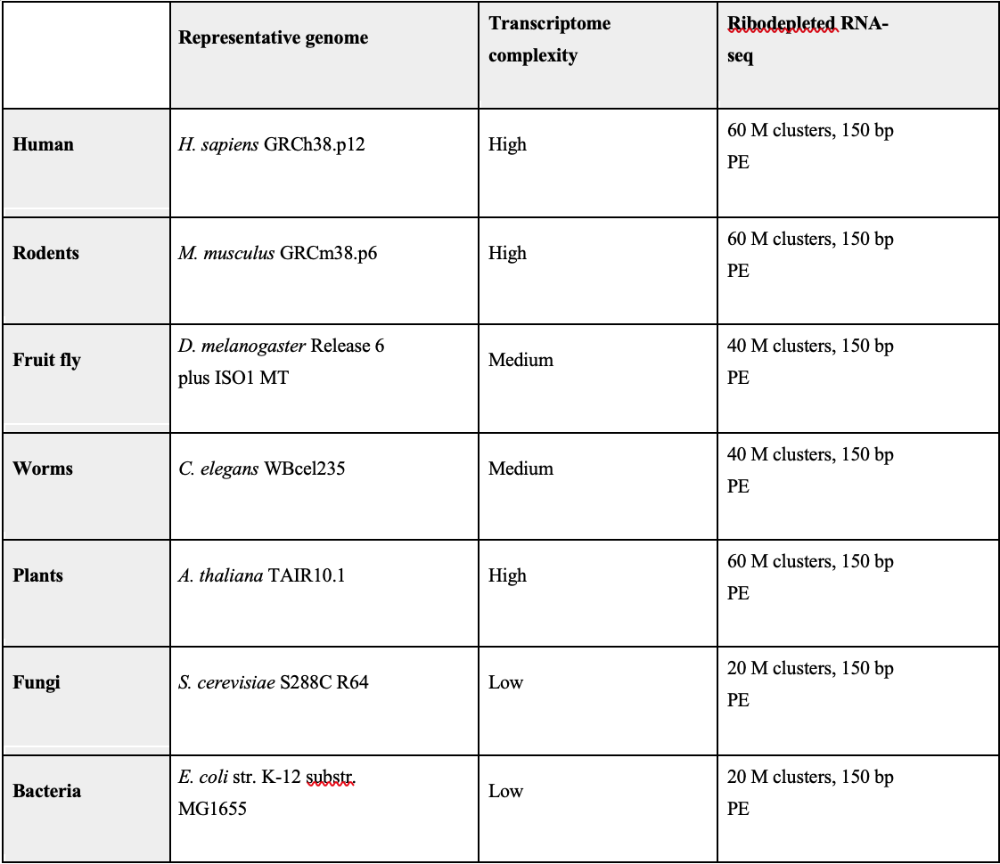

# GeneLab SOP for Generating iSeq HTStream Output to Calculate Library Pooling Values #
Document No.:	GL-SOP-8.2  
Version:	1.0  
Created:	04_10_2020  
Last revised: 	04_10_2020  
Last revised by:	Yi-Chun Chen  

## Purpose/Scope ###

The guide describes the steps required to calculate library pooling volumes after the first iSeq (pool by volume) run and instructions on how to pool libraries when there is not enough volume. 
*Note: After the 1st iSeq run, follow the GL-SOP-8.1 to generate iSeq QC report “complete_rRNA_report.txt” on MMOC or any command line interface on your local computer. Download the “HTStream_result_pooling_calculator.xlsx” from GeneLab file folder and save to your desktop before starting.

## Procedure ##

1.	Open the “complete_rRNA-report.txt” file with excel.
2.	Check to see if you have total sample number + 2 rows in the sheet. 
For example: If you have 48 samples in your pool, there should be 50 rows total in the file.
3.	Insert a new column to the left of column A. In cell A1, write in “S#”. We will use each samples’ “S#” to sort later. 
4.	For each cell in column A starting from A2, copy and paste the S# from the right of each cell. 
For example: If cell B2 says “UMRR_RNA_S124”, enter “124” in cell A2. If cell B3 says “RR9_BSL_B4_LVR_RNA_S5”, enter “5” cell A3.
5.	Sort all samples by “S#”.   
  a.	Select top row then go to the menu bar, select “Data”-> “Auto filer”. Sort column A by ascending order. You should see the lowest number at the top being “0” and the highest number at the bottom being “your total sample #”.  

6.	If this iSeq run shows a balanced pool of samples with an acceptable distribution of reads between the libraries (eg. number of reads from all samples are similar), re-pooling is not necessary. Skip to step 26 to estimate NovaSeq reads.
7.	Open the “HTStream_result_pooling_calculator.xlsx” file. Before working on the sheets, save this file to the project folder you are currently working on using the “Save As” function. Do not modify the original file or the formulas in the cells. 
Note: When working on your own copy of sheets, only edit the cells in yellow and not the cells in green.
8.	Open the copied “HTStream_result_pooling_calculator.xlsx”, unprotect both tabs by right click on the tabs and select “Unprotect Sheet”. Save the file and perform the rest of the steps in this file.
9.	In the 2nd tab “1_To-calc_repool_vol”, fill in total sample number in cell A11.   
  a.	For example: If you have 48 samples in the pool, put 48 in cell A11.  

10.	Go back to “complete_rRNA-report.txt” file, copy all sample name from column B “Sample” and paste to column C in the 2nd tab named “1_To_calc_repool_vol” of “HTStream_result_pooling_calculator.xlsx” file starting from cell C11.
11.	Go back to “complete_rRNA-report.txt” file, copy all numbers from column E “%_total_reads” and paste to column D in 2nd tab named “1_To_calc_repool_vol” of “HTStream_result_pooling_calculator.xlsx” file starting from cell D11.
12.	Go back to “complete_rRNA-report.txt” file, copy all numbers from column H “%_Mus_rRNA” and paste to column E in the 2nd tab named “1_To_calc_repool_vol” of “HTStream_result_pooling_calculator.xlsx” file starting from cell E11.
13.	On the same sheet, fill in volume multiplier in cell A23. Start with 1. You should see numbers populated in column G with the volume to take from each sample. Adjust the multiplier to 2, 3, or 4+ so that all numbers in column G falls between 2 to 20.
Note: this does not include sample “0, undetermined”.
14.	Use the numbers in column G to pool your samples. Make sure to match the sample name in both files.   
  a.	Note: if you do not have enough library to pool, (i.e. you need 25uL of one library based on the calculation, but you only have ~17uL left), follow “sub-pooling guide” from step 17 to 23 below to pool samples.   

15.	After pooling is complete, mix well, measure pool concentration with Qubit and run on the 2nd iSeq. 
16.	After the 2nd iSeq run, follow the GL-SOP-8.1 to generate another iSeq QC report. Then, follow steps 24 to 35 to check if the pool is balanced. 

**Instructions to pool samples when you do not enough volume:**
  
* Note: The sub-pooling guide is used to create 2 pools using different volume multipliers (step 13) and then mixed back together to create a balanced pool. This way we avoid exhausting the libraries with lower yield. Only use steps 17 to 23 if you do not have enough library to pool according to your calculation.

17.	Based on the volumes-to-pool calculation, take the top ½ or 1/3 of the library that requires the most pool volume. Using 10uL as a cutoff first then adjust.   
  a.	Here we spilt the libraries into 2 groups: high-concentration group (which means you will pool less from each library) and low-concentration group (which means you will pool more from each library).  

18.	For the low-concentration group, divide the “volume-to-pool” by a factor of 2 or 3. You should see the required volume is now 2 or 3-fold less than before. Check to see if all the numbers for this group is now less than what you have in the well. Adjust the factor as needed but make sure the lowest volume-to-pool is still higher than 2.  
  a.	Note: You can adjust the factor as needed but smallest whole number that can be used is the best as this step introduces some variance into your pool.  
  b.	Here we assume that the factor chosen at the end is “3”.  

19.	Combine the individual libraries according to your calculation into 2 separate pools (high and low-concentration).
20.	Mix both pools well by vortexing. 
21.	Mix the 2 pools by the factor used before in step 17. High-concentration pool should be used less while the low-concentration pool should be used more. Use at least 10uL from each pool.  
  a.	For example: “3” was used in step 17. You should mix 3 parts (30uL) of the low-concentration pool with 1 part (10uL) of the high-concentration pool.  

22.	After pooling is complete, mix well, measure pool concentration with Qubit and run on the 2nd iSeq to check if the pool is balanced. 
23.	After the 2nd iSeq run, follow the GL-SOP-8.1 to generate another iSeq QC report. Then, follow steps 24 to 35 to check if the pool is balanced. 

**Instructions to use iSeq HTStream output to estimate NovaSeq reads:**

* Note: After 2nd iSeq run, follow the GL-SOP-8.1 to generate iSeq QC report “complete_rRNA_report.txt” on MMOC or any command line interface on your local computer. Download the “HTStream_result_pooling_calculator.xlsx” from GeneLab file folder and save to your desktop before starting. Here we will call the 2nd HTStream result “balanced_pool_complete_rRNA-report.txt”.

24.	Open the “balanced_pool_complete_rRNA-report.txt” file with excel.
25.	Repeat steps 2-5 with this file.
26.	Find the previously copied “HTStream_result_pooling_calculator.xlsx” in the project folder you are working on. Repeat steps 7-8 if you don’t have it. 
27.	Open the copied “HTStream_result_pooling_calculator.xlsx” file. In the 3rd tab “2_Balanced_pool_read_estimate”, fill in total sample number in cell A11.   
  a.	For example: If you have 48 samples in the pool, put 48 in cell A11.  

28.	You should see the average expected reads per sample on every type of flow cell you may run.
29.	Go back to “balanced_pool_complete_rRNA-report.txt” file, copy all sample name from column B “Sample” and paste to column C in the 3rd tab named “2_Balanced_pool_read_estimate” of “HTStream_result_pooling_calculator.xlsx” file starting from cell C11.
30.	Go back to “balanced_pool_complete_rRNA-report.txt” file, copy all numbers from column E “%_total_reads” and paste to column D in 3rd tab named “2_Balanced_pool_read_estimate” of “HTStream_result_pooling_calculator.xlsx” file starting from cell D11.
31.	Go back to “balanced_pool_complete_rRNA-report.txt” file, copy all numbers from column H “%_Mus_rRNA” and paste to column E in the 3rd tab named “2_Balanced_pool_read_estimate” of “HTStream_result_pooling_calculator.xlsx” file starting from cell E11.
32.	You should now see estimated reads from each sample on different types of flow cell populated in column G through J.
33.	Select the one column with the flow cell you plan to run (SP, S1, S2, or S4). Based on the estimate reads, check to see if the reads are within 2 folds of each other. Also, check to see if all samples will meet the GeneLab sequencing depth standard based on the model organism and flow cell used.

Table 1. GeneLab recommended target total RNA-Seq sequencing depth. Available on https://genelab.nasa.gov/total-rna-seq

34.	If the estimated reads meet the GeneLab standard, proceed to run this pool on NovaSeq. Obtain concurrence from the team if necessary.
35.	If the estimated reads do not meet the GeneLab standard, contact GeneLab science team to discuss options to optimize your run.

